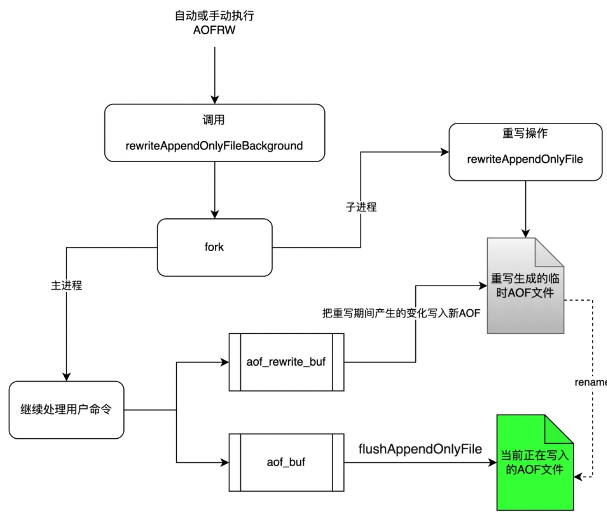
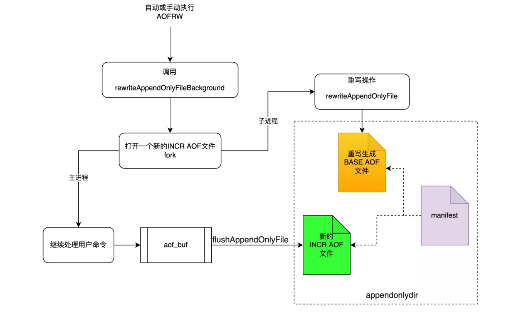

# work
工作的一些问题和学习记录

>> 线上事故记录和优化按月记录
>> 学习记录放在最外面这个README里
>> 这个也就当日记看看，不会系统的讲一些东西

不定期开新坑+补充

- [OpenResty](#OpenResty)
    - [LuaJit](#luajit)
        - [测试代码](#test)
        - [table优化](#table)
        - [string优化](#string)
        - [os.*](#os)

    - [OpenResty Lua](#openresty-lua)
        - [basic](#openresty-basic)
        - [cosocket](#cosocket)
        - [lua-resty-core](#lua-resty-core)
        - [cache](#cache)
    
    - [压力测试和火焰图](#压力测试和火焰图)
        - [wrk](#wrk)
        - [火焰图](#火焰图)

- [redis](#redis)
    - [base-data-structure](#redis-data-structure)
        - [string](#redis-string)
        - [hashtable](#redis-hashtable)
        - [ziplist](#ziplist)
        - [quicklist](#quicklist)
        - [skiplist](#skiplist)
    - [redis线程](#redis-multi-thread)
        - [后台任务线程](#redis-bio)
        - [reactor](#redis-reactor)
    - [redis持久化数据](#redis-persist-datas)
        - [RDB](#redis-rdb)
        - [AOF](#redis-aof)
    - [redis主从复制](#redis-replica)
    - [redis哨兵](#redis-sentinel)
        - [init](#redis-sentinel-init)
        - [vote](#redis-sentinel-vote)
    
- [性能优化](#性能优化)
    

- 按月总结的bug,后端问题排查和优化
    - [2207](doc_2207)
        - [排查redis连接数过高](doc_2207#p1)
        - [排查nginx worker CPU占用100%](doc_2207#p2)
        - [http模块版本较低踩坑](doc_2207#p3)
    
    - [2208](doc_2208)
        - [天赋模块bug，战报反SQL注入转义bug，userData:NULL bug](doc_2208)
        - [后端性能优化, 登陆协议部分系统](doc_2208)
            - 佣兵
            - 活动道具
            - 公会信息
            - 竞技场信息
            - 战力模块

    OpenResty
    ====

    
    这周比较系统的学习了一下OpenResty（当然说掌握还差很多，但也收获不小），看看平时开发/测试的时候还是有一些坑，要进行规避
    
    luajit
    ====
    
    LuaJit ~= Lua5.1，用的时候还是要仔细选择高性能接口。Jit的原理基础的都懂，高深的暂时没有研究的想法。
    
    
    test
    ====
    
    OpenResty的Lua是LuaJit2.1，测试的时候有点不一样，根据其作者的建议，如果我们要测试一段代码(比如这个func)，那他应该要长这样：
    ```lua
    local function test(func, ...)
        -- 让LuaJit觉得这段代码过热从而翻译成字节码
        for i = 1, 10000 do
            func(...)
        end
        ngx.update_time()
        local t = ngx.now()
        func(...)
        ngx.update_time()
        print(ngx.now() - t, 's')
    end
    local function test_a()
    ....
    end
    test(test_a)
    ```
    下面第一个模块table的时候会比对一下不循环很多次的时候和循环很多次的时候的区别
    
    table
    ====
    
    新操作还是不多的，concat之类的操作项目里会经常用。以前知道table.new，但一直用的比较少，这次来实际对比一下有什么区别
    测试code大概是
    ```lua
    local sz = 1000000

    local function test_a(real)
        local a = table.new(sz, 0)
        for i = 1, sz do
            a[sz] = sz - i
        end
    end
    -- 0.0049998760223389s
    local function test_b(real)
        local a = {}
        for i = 1, sz do
            a[i] = sz - i
        end
    end

    -- 0.027999877929688s
    ```
    性能差距还是有点大的，sz去掉一个0（这个sz跑insert根本跑不完，O(t*n^2)，去掉一个0我都跑了特别久），测试一下`table.insert`，比第二个还慢几十倍，原因是每次取#是On的操作，虽然LuaJit官网说可以优化append类型的insert，但是还是很慢，估计#操作并不好优化，不然应该是慢2倍而不是几十倍了。另外不循环很多次前两个时间上没有区别。
    实际项目中，对于已知大小的table/hashtable，应当采用`table.new`，`table.insert`虽然代码可读性很高，但是还是减少使用，冷热代码均是如此，原因是因为对于没被Jit优化的代码他是真的O(n^2)，优化过之后也有几十倍的性能差距
    
    table.clear和table池估计实际用不到，不测了，等table new成为性能瓶颈可以回来看看
    
    
    string
    ====
    
    - 字符串拼接
        比较基础，项目里我也用的比较多，`table.concat`优化，原理层面也比较简单，就是Lua的字符串理解成一个final类型的量，每次Jit会去string池检查有没有这个final的量，有就把新字符串指向他，没有就新建一个扔进去。Gc的时候没有引用的就删掉了，所以顺序拼接"a", "b", "c"m "d"内存里会有"a", "b", "c", "d", "ab", "abc", "abcd", concat可以把中间的省掉，会省很多内存（这里看上去小是因为string每个只有一个字母，长了就明显了。这个项目里str的基类拼接没用，我改了一下。
    
    - string.find,这个我看最新的[luajit NYI](http://wiki.luajit.org/NYI)里面,他说Only plain string searches (no patterns). 也就是你往里面扔一坨正则不行，不但不行，他的意思其实是要把find的第四个参数传true才行,他本来是`string.find(s, pattern [, init [, plain]] )`，要显式声明第四个true。这个我看项目里str库的代码传了，之前的大佬太猛了。但是后面一些str操作就没有了，如果哪天项目测试压力小一点，考虑给项目里面换成ngx.re，因为用的地方太多了，换的话就也不太好换，但先记住这个find很蠢
    - string.byte，据说这个是神器，string.char(string.byte("abc", 1, 2)) 比string.sub的写法少生成很多中间string，让我来试试，测试用1000长度的字符串随机两个pos，分别用string.sub(posa, posb), string.char(string.byte("abc", posa, posb))比对运行时间
        ```lua
        local sz = 1000

        local str
        
        local a = table.new(sz, 0)
        for i = 1, sz do
            a[i] = math.random(9)
        end
        
        str = table.concat(a)
        
        -- 0s
        local function test_a()
            local t = table.new(1000, 0)
            for i = 1, 1000 do
                local pa = math.random(sz - 100)
                local pb = pa + math.random(sz - pa)
                t[i] = string.sub(str, pa, pb)
            end
        end
        
        -- 0.0019998550415039s
        local function test_b()
            local t = table.new(1000, 0)
            for i = 1, 1000 do
                local pa = math.random(sz - 100)
                local pb = pa + math.random(sz - pa)
                t[i] = string.char(string.byte(str, pa, pb))
            end
        end
        ```
        测试并没有得到我想要的结果，byte这样会更慢，应该是char+byte是两步操作，且sub和char，byte都不在NYI里面，所以单独效率上没有区别，那再看看后面这种是否比sub更节约内存，top了一下分别运行，感觉没有，内存是一样的。
        说明string.sub是可以用的操作，OpenResty最佳实践的作者可能版本老一些，或者我测试的姿势不对.
        
    
    os
    ====
    
    Lua的os，io库都是同步阻塞操作，而OpenResty的理念是同步非阻塞，他有一套自己的shell工具`resty.shell`，用于执行shell语句，大概长这样：
    ```lua
    local resty_shell = require 'resty.shell'
    local ok, res, err, reason, status = resty_shell.run([[
        echo lunlungaygay
    ]])
    if ok then
        ngx.say(res)
    end
    ```
    io同样有一套，如果以前没有需要重新编译nginx
    ```lua
    local ngx_io = require 'ngx.io'
    local path = 'xxx'
    local file, err_1 = ngx_io.open(path, 'rb')
    local data, err_2 = file:read('*a')
    file:close()
    ```
    项目里用到shell操作的也就取时间，os.date啥的，比较轻量，还没有成为性能瓶颈，就先不优化了，将来有哪些大型shell操作，再考虑用这个解决。
    
    另外课上有句话说的我很认同，io和CPU消耗不会消失，他只是去了另一个地方，所以当有这种大型的磁盘读写，CPU计算的时候，可以适当交给别的服务做。这一点项目里的体现就是lua-battle，他把大量的CPU计算用resty.http扔给了另一台机器做，resty.http是基于cosocket的http模块，发过去之后worker会把当前请求yield掉，主要提供服务的机器CPU就能处理别的请求了，等战斗的机器处理完结果，这个战斗的请求又会被resume回来，这样就不会有一个worker一直用CPU，阻塞了其他请求的情况。
    
    lua部分的坑先开到这里
    最后写一下我vimrc里面支持luajit的配置
    ```vim
    let g:syntastic_check_on_open = 1
    let g:syntastic_lua_checkers = ["luac", "luacheck"]
    let g:syntastic_lua_luacheck_args = "--no-unused-args --std luajit --globals ngx"
    ```
    
    openresty-lua
    ====
    
    这个模块用于对openresty lua的查漏补缺。
    
    openresty-basic
    ====
    
    OpenResty个人感觉下来对后端开发最大的便利就是同步非阻塞，不然后端读个redis实现起来可能相当复杂，后端每个redis操作相当于都是传命令+回调，先coroutine 装一下redis操作，里面luasocket连一下redis，协程阻塞读，读完返回resume执行回调。这样就太麻烦了，而且相当于没有好好利用nginx的事件循环机制去做这些事情。

    OpenResty在这一块已经完全做好了，在有网络IO的情况下他会自动把当前的lua runtime挂起来，然后把网络IO的回调注册到Nginx的事件循环里面，这个时候worker的CPU就可以去处理别的请求了。网络IO返回之后，这个lua runtime又会被唤醒（基于Nginx，其实是等待worker调度，这里也可以看出大量非网络IO的操作会影响其他协议的处理速度，两个都接到一个worker，都走到content_by_lua，一个开始大量运算，另一个就会被长时间挂起，引发更多问题）。这里还要说一下同步非阻塞说的必须是OpenResty提供的模块，nginx-xxx-module或者lus-resty-xxxx才是同步非阻塞的，因为只有用人家的接口人家才自动帮你做挂起，注册，唤醒这一系列操作。所以自己写的网络IO等操作（比如自己写了个模块调用luasocket请求），lua自带的函数（os.xxx, io.xxx），均不能被OpenResty调度，都是同步阻塞的，开发中要尽量减少使用，如果有大量的类似CPU运算，文件读取的操作，考虑扔给其他服务做。
    
    cosocket
    ====
    
    这个模块是现在OpenResty比较推荐使用的网络模块，lua-resty-*的大部分网络库比如redis mysql dns等都是基于这个实现的，也就是[ngx.socket.tcp](https://github.com/openresty/lua-nginx-module#tcpsockconnect)（其实也有[udp](https://github.com/openresty/lua-nginx-module#ngxsocketudp)版本），他可以看作lua-socket的非阻塞版。大部分生命周期都是可以使用的。
    
    理解是做什么的也很简单，协程套接字这个直译已经足够明确，做的是socket的工作，同时满足OpenResty同步非阻塞的基本要求，调用的时候会把当前请求挂起，并把网络事件的回调注册给Nginx

    仔细阅读这个的文档之后可以回答我上个月遇到的很多问题，比如connect的时候调用的是nginx配置的resolver，连接建立之后需要手动sslhandshake等。当然最重要的还是遇到问题知道来哪里查，以及网络基础要打好，这个也是后面学习的重点。
    
    lua-resty-core
    ====
    
    这个是OpenResty在某个版本后默认开启的模块，原理是改用了[luajit ffi](http://luajit.org/ext_ffi_api.html)去进行实现，而不是lua c function，这两者最主要的区别是lua ffi可以被Jit追踪优化，但是lua c function不行

    lua c function感觉主要缺陷是c和lua之间的返回值无法直接交换，比如返回值添加一个字符串需要c那边调用`lua_pushlstring(L, (char *) res, res.len)`把一个指定大小的字符串压到Lua的虚拟栈里。这个和之前做前端时候的tolua感觉挺像的，或者说跨语言交互原理上就是一样的。
    
    两者对比的优缺点还是很显然的，ffi是Jit提供的，很显然可以被Jit优化，而且写起来更简单，不用去栈里把返回值扣出来。但缺点是这个内存在某些情况下要你自己管理，如果是Lua C Function，那因为这个栈在Lua这边，所以GC一下没引用就没了。但是ffi的内存并不全是Lua管理的，也就是`ffi.new`返回的是cdata，这部分是LuaJit管理，`ffi.C.malloc`这样就是申请了一块C内存，需要`local p = ffi.gc(ffi.C.malloc(n), ffi.C.free)`，给他注册一个gc回调，p = nil的时候这个就被释放了。这样其实也有个好处，他可以突破OpenResty对Lua Vm 2G内存的限制
    
    然后去项目里看看，发现OpenResty的版本比较低，实际上也没在init阶段require，相当于我们项目还是lua-nginx-module 的实现，这个如果底层的ngx.xxx成为性能瓶颈，可以成为一个优化的点
    
    cache
    ====
    
    项目里用cache的地方不多，主要原因是大部分数据其实在redis里，mysql里面都是一些战报之类的数据，战报数据比较冷。
    
    用到的地方大概就是存gate信息的地方，存google cloud token的地方，这种是因为每个请求都要访问，属于过热的数据，就在cache里给他缓存了一层。当然也有在worker层面缓存的数据，主要是一些重构的表，一些redis脚本的sha1值之类的。但是这些没有用到cache api，而是直接
    ```lua
    local data_by_activity_id = nil
    
    function _M:get_datas_by_activity_id(activity_id)
        if data_by_activity_id == nil then
            -- init cache
            ...
        end
        return data_by_activity_id[activity_id]
    end
    ```
    这种就比较简陋，但也能用，也满足我们reload worker的时候清空的需求。
    
    cache的话OpenResty主要提供两种，`ngx.shared.dict` 和`resty.lrucache` ,主要区别是dict是跨worker共享的，lrucache是单worker的数据。这两个就不会被reload干掉，放在我们项目，shared dict有网关或者token的应用场景，lrucache暂时没有
    
    
    
    压力测试和火焰图
    ====
    
    wrk
    ====
    
    wrk是一款比较好用的压力测试工具，他相比较ab而言的最大优点是可以很轻松的多线程压测，单命令可以比较容易的产生跑满OpenResty的所有worker的压力（可以自定义压测线程数），并且可以自定义Lua脚本（也就是支持用Lua去模拟真实的请求）
    
    ```shell
    (base) ➜  ~wrk --help
    Usage: wrk <options> <url>                            
      Options:                                            
        -c, --connections <N>  Connections to keep open   
        -d, --duration    <T>  Duration of test           
        -t, --threads     <N>  Number of threads to use   
    
        -s, --script      <S>  Load Lua script file       
        -H, --header      <H>  Add header to request      
            --latency          Print latency statistics   
            --timeout     <T>  Socket/request timeout     
        -v, --version          Print version details      
    
      Numeric arguments may include a SI unit (1k, 1M, 1G)
      Time arguments may include a time unit (2s, 2m, 2h)

    ```
    
    c，d，t之类的都比较好理解，主要看这个-s，有几个操作
    ```lua
    -- 线程建立的时候有这个走这个
    function setup(thread)
    -- 运行时
    
    -- 单线程取命令行参数
    function init(args)
    -- 相邻请求延迟时间，更精细的控制-d
    function delay()
    -- 每次请求调用，可以生成body，官方建议是写一些简单的逻辑在里面，或者固定，不然就成了测试wrk本身的性能了
    function request()
    -- 解析结果，官方建议是不写，这样wrk就可以不解析header和body，节省时间
    function response(status, headers, body)
    
    -- 测试全部结束，可以自己处理一下结果
    function done(summary, latency, requests)
    
    
    -- 全局表
    wrk = {
        scheme  = "http",
        host    = "localhost",
        port    = 8080,
        method  = "POST",
        path    = "/",
        headers = {},
        body    = nil,
        thread  = <userdata>,
        format = function(method, path, headers, body)
        end,
        lookup = function(host, service)
        end,
        connect = function(addr)
        end,
    }
    
    -- 大概往我们战斗服发一下, 先打一场战斗，在Luaserver 把body存到文件battle
    local file = io.open('battle')
    local body = file:read('*a')
    file:close()
    wrk.method = "POST"
    wrk.body = body
    wrk.headers["Content-Type"] = "application/x-www-form-urlencoded"
    
    request = function()
        return wrk.format('POST', '/battle/v1')
    end
    ```
    上面就用wrk给我们战斗服发了一堆相同的战斗。实际应用中我们暂时用不到压力测试，一般都是火焰图看看是哪个函数，继而优化。

    我一般找到性能瓶颈之后，优化具体的接口我都是用[test](#test) 模块的办法自己写个command脚本，判断一下是否优化成功。wrk可以当成一个工具技能，先留着，相信早晚一天有用
    
    火焰图
    ====
    
    这个目前项目里有on-cpu的火焰图，一般是看那个。具体的图不方便放，上个月的文档里介绍了[openresty-systemtap](https://github.com/Wavator/openresty-systemtap-toolkit)这个东西，使用它定位了一个worker 100%跑满CPU的问题，但是实际应用中，这种死循环的情况并不多见，更多的时候是玩家感觉卡顿，要分析代码性能。
    
    这种时候就轮到火焰图出场了，用上面的工具结合[FlameGraph](https://github.com/brendangregg/FlameGraph)线上CPU高过一定值的时候会自动采样，并记录结果。
    ```shell
    TAPPATH=xxxxx
    FLAMEPATH=xxxxxxx
    
    pid,cpuload=#top+grep+awk print $1,$9+sort筛出一个最高的pid和cpuload
    #cpuload比较大就执行抓+存+推送的流程，我猜是这样写的，图省事可以全拿出来
    ${TAPPATH}/ngx-sample-lua-bt -p ${pid} --luajit20 -t 5 > /tmp/tmp.bt
    ${TAPPATH}/fix-lua-bt /tmp/tmp.bt > /tmp/tmp_1.bt
    ${FLAMEPATH}/stackcollapse-stap.pl /tmp/tmp_1.bt > /tmp/a.cbt
    ${FLAMEPATH}/flamegraph.pl /tmp/a.cbt > /tmp/a.svg
    
    #scp或者ftp之类的把这个a.svg换个名字发出去，放到网页上大家就都能看了
    ```
    
    redis
    ====
    
    这个文档写的时候我的redis已经使用了半年，我们后端大部分逻辑是基于redis操作的，所以对一些基础命令已经十分熟悉了，对底层实现也有了解，知道什么情况下选用什么数据结构。这边不再记录这种比较基础的东西，当然如果有薄弱的模块，依然会在对应模块下面补充底层原理的研究。
    
    redis的学习基于两本书和一节课，《Redis开发与运维》，《Redis设计与实现》，第一本我拿来当作工具书，一些场景里的命令和基本原理，都是看这本书学习的，第二本书是我看源码分析的书，写doc的时候还在慢慢看这本书。这两本书都比较不错，但是redis版本有些老，后面极客时间上也学习了蒋德钧老师的《Redis核心技术与实战》，这门课的课程本身和评论区让我大受启发，本来doc里不准备写redis的，但学了这门课之后深感Redis的学习还是太浅。准备把课程中和评论区的一些实战经验，设计经验加以整理。
    
    redis-data-structure
    ====
    
    redis的基础数据结构
    
    redis-string
    =====
    
    string应该是redis里面比较简单的结构，只有SDS一种实现，编码上注意int，embstr，raw就行
    1. int不是无上限的，超出再incr会抛出异常，所以这个指令或者说redis里面所有xxxincr，xxxincrby都要注意这一点。当然出问题一般内网就直接看到了。另外redis的整数类型也有池子，但是内存淘汰策略开启了LRU之类的策略之后这个就没用了，因为指到常量对象上不好统计引用。
    2. embstr就是很短的字符串，老版本39位，新版本44位，优点是内存是一次申请完的连续内存，更紧凑，没有指针乱指，只要释放一次，且查找更快。业务里一般无法避免value太长，但是可以注意的是整个redis的string是一种实现，都适用这些策略。
    3. raw就是最一般的那种redis-str，没有什么优化，申请内存就是倍增到MB之后每次增加1MB，当然我们线上也没这么大的KEY。
    4. redis里面的字符串，维护了长度（保证二进制安全，避免strlen等优点），维护了编码（都要维护），所以一个string object本身就是有一个基础大小在这里的，如果短string特别多，就会严重浪费内存。这种情况可以考虑通过一些id的映射，让这些短string存在hashset之类的结构里（当然hashset的encoding要ziplist，比如线上hash zip entries设置512，那id/500之后500落到一个hashkey里，这500个小str就共享一个ziplist了）。
    
    redis-string-code
    ====
    
    1. 编译优化
    ```c
    struct __attribute__ ((__packed__)) sdshdr5 {
        unsigned char flags; /*SDS类型*/
        char buf[];
    };
    struct __attribute__ ((__packed__)) sdshdr8 {
        uint8_t len; /* 现有长度*/
        uint8_t alloc; /* 已经分配的空间 */
        unsigned char flags; /* 类型 */
        char buf[];
    };
    struct __attribute__ ((__packed__)) sdshdr16 {
        uint16_t len;
        uint16_t alloc;
        unsigned char flags;
        char buf[];
    };
    ```
    `__attribute__ ((__packed__))` 是紧凑分配内存的编译器优化项，c默认会按照8字节对齐的方式给结构体分配内存，向上分配最近的一个8的倍数。这样如果是特别短的字符串会浪费几个字节。
    然后他shshdr*，除了5之外都有2个uint*_t, unit*_t用来表示字符串长度和当前申请的内存，对不同长度的字符串用不同的unit记录这些数据，可以节约内存。
    
    2. string编码的部分，现在的object.c里面写的代码是
    ```c
    #define OBJ_ENCODING_EMBSTR_SIZE_LIMIT 44
    robj *createStringObject(const char *ptr, size_t len) {
        if (len <= OBJ_ENCODING_EMBSTR_SIZE_LIMIT)
            return createEmbeddedStringObject(ptr,len);
        else
            return createRawStringObject(ptr,len);
    }
    ```
    这个我看的第一本书说是39，应该比较老了，git看是3.0就是44了,39算的比较粗糙，实际上是一次内存申请出来是64，减掉redisObject这个结构自带的16，再减sds自带的维护长度内存类型的3，再减一个'\0'，一共就是44.
    ```c
    typedef struct redisObject {
        unsigned type:4;
        unsigned encoding:4;
        unsigned lru:LRU_BITS; /* lru time (relative to server.lruclock) */
        int refcount;
        void *ptr;
    } robj;
    ```
    
    这里是4+4+8=16，为什么最上面三个unsigned是4，原因是redis用了: ，也就是位域定义，来极致的节省内存，也就是这个unsigned有32位，type拿4位，encoding拿4位，剩下24位给lru。
    
    embtr申请内存是
    ```c
    robj *createEmbeddedStringObject(const char *ptr, size_t len) {
        robj *o = zmalloc(sizeof(robj)+sizeof(struct sdshdr8)+len+1);
        struct sdshdr8 *sh = (void*)(o+1);
        ...
    }
    ```
    一次把robj的和sdshdr8的都申请出来了，所以说是申请一次，释放一次。
    
    3. 整数池的使用
    ```c
    robj *createStringObjectFromLongLongWithOptions(long long value, int valueobj) {
        robj *o;
    
        if (server.maxmemory == 0 ||
            !(server.maxmemory_policy & MAXMEMORY_FLAG_NO_SHARED_INTEGERS))
        {
            /* 这一行时说如果没有设置内存淘汰策略（swap），或者说策略不是某种策略（其实是LRU和LFU），就默认启用小整数对象池 */
            valueobj = 0;
        }
    
        // 小整数
        if (value >= 0 && value < OBJ_SHARED_INTEGERS && valueobj == 0) {
            incrRefCount(shared.integers[value]);
            o = shared.integers[value];
        } else {
            // longlong内encode才是int，否则就是str
            if (value >= LONG_MIN && value <= LONG_MAX) {
                o = createObject(OBJ_STRING, NULL);
                o->encoding = OBJ_ENCODING_INT;
                o->ptr = (void*)((long)value);
            } else {
                o = createObject(OBJ_STRING,sdsfromlonglong(value));
            }
        }
        return o;
    }
    
    /* 比较具体的值new一般是这个 */
    robj *createStringObjectFromLongLong(long long value) {
        return createStringObjectFromLongLongWithOptions(value,0);
    }
    
    /* 一般是key调用这个，方便统计引用次数 */
    robj *createStringObjectFromLongLongForValue(long long value) {
        return createStringObjectFromLongLongWithOptions(value,1);
    }
    ```
    
    内存淘汰的部分，可以看到LRU和LFU才会完全禁用小整数对象池
    ```c
    #define MAXMEMORY_FLAG_NO_SHARED_INTEGERS \
        (MAXMEMORY_FLAG_LRU|MAXMEMORY_FLAG_LFU)
    ```
    
    4. 一个最大的redis string是512M
    ```c
    createLongLongConfig("proto-max-bulk-len", NULL, DEBUG_CONFIG | MODIFIABLE_CONFIG, 1024*1024, LONG_MAX, server.proto_max_bulk_len, 512ll*1024*1024, MEMORY_CONFIG, NULL, NULL),
    ```
    
    5. 内存申请1MB以下倍增，以上每次加1MB
    ```c
    #define SDS_MAX_PREALLOC (1024*1024)
        sds _sdsMakeRoomFor(sds s, size_t addlen, int greedy) {
        ... 
        len = sdslen(s);
        sh = (char*)s-sdsHdrSize(oldtype);
        reqlen = newlen = (len+addlen);
        if (greedy == 1) {
            if (newlen < SDS_MAX_PREALLOC)
                newlen *= 2;
            else
                newlen += SDS_MAX_PREALLOC;
        }
    
        type = sdsReqType(newlen);
        ... 
        return s;
    }
    
    ```
    
    6. 注意redis的key都是sds
    ```c
    void dbAdd(redisDb *db, robj *key, robj *val) {
        sds copy = sdsdup(key->ptr);
        ...
    }

    ```
    
    Redis Server读取client的请求的时候，会先读如缓冲区，这个缓冲区也是SDS
    AOF缓冲区也是SDS
    
    string的部分先整理到这里
    
    redis-hashtable
    ====
    
    1. 4.0以后的hash算法是siphash
    2. hash的元素个数太多的时候会检查是否需要扩容,总是拓展成2^x
    3. rehash是渐进式的，全局表有个定时器，太久没访问一次删一百个哈希桶，自己定义的表每次操作清一个哈希桶
    4. rehash没完成的时候不能再rehash
    5. rehash判断的时候，如果能找到AOF重写或者RDB生成之类的子进程，哈希因子就会变成5，也就是严重冲突的时候依然会rehash
    6. 很多上层数据结构，和redis本身的kvdb，过期键之类的都是hash的实现，hash是最基本的数据结构之一
    
    redis-hashtable-code
    ====
    
    1. hash算法的选择
        redis 当前版本是siphash，但是算法细节没有过多了解。
        ```c
        /* The default hashing function uses SipHash implementation
         * in siphash.c. */
        
        uint64_t siphash(const uint8_t *in, const size_t inlen, const uint8_t *k);
        uint64_t siphash_nocase(const uint8_t *in, const size_t inlen, const uint8_t *k);
        
        uint64_t dictGenHashFunction(const void *key, size_t len) {
            return siphash(key,len,dict_hash_function_seed);
        }
        ```
    2. hash拓展逻辑：每次expand拓展到下一个2^x
    ```c
    static signed char _dictNextExp(unsigned long size)
    {
        unsigned char e = DICT_HT_INITIAL_EXP;
    
        // 不能超过longmax
        if (size >= LONG_MAX) return (8*sizeof(long)-1);
        while(1) {
            // 每次指数左移一位
            if (((unsigned long)1<<e) >= size)
                return e;
            e++;
        }
    }
    
    int _dictExpand(dict *d, unsigned long size, int* malloc_failed)
    {
    
        /* 在rehash或者rehash之后的size比要用的小就不合适 */
        if (dictIsRehashing(d) || d->ht_used[0] > size)
            return DICT_ERR;
    
        dictEntry **new_ht_table;
        unsigned long new_ht_used;
        signed char new_ht_size_exp = _dictNextExp(size);
    
        /* 把幂次拿出来当新的大小 */
        size_t newsize = 1ul<<new_ht_size_exp;
        if (newsize < size || newsize * sizeof(dictEntry*) < newsize)
            return DICT_ERR;
    
        /* rehash完是同样大小不行 */
        if (new_ht_size_exp == d->ht_size_exp[0]) return DICT_ERR;
    
        /*
            下面把hash[1]的空间malloc出来，给hash[1]赋值
        */
        ...
        return DICT_OK;
    }
    
    /* 外部都是调用这个，如果需要拓展则变为两倍 */
    static int _dictExpandIfNeeded(dict *d)
    {
        /* 还在rehash，那就不用拓展 */
        if (dictIsRehashing(d)) return DICT_OK;
    
        /* 空表 */
        if (DICTHT_SIZE(d->ht_size_exp[0]) == 0) return dictExpand(d, DICT_HT_INITIAL_SIZE);
    
        if (d->ht_used[0] >= DICTHT_SIZE(d->ht_size_exp[0]) &&
            
            // 这里是个全局设置的变量，AOF重写，RDB生成等过程，会把他设置成0，也就是不特别大的情况都不rehash
            (dict_can_resize ||
            // 比较哈希因子，如果特别大（这个数是5），那就只能强制rehash
             d->ht_used[0]/ DICTHT_SIZE(d->ht_size_exp[0]) > dict_force_resize_ratio) &&
             // 能不能申请下来这些内存
            dictTypeExpandAllowed(d))
        {
            return dictExpand(d, d->ht_used[0] + 1);
        }
        return DICT_OK;
    }
    ```
    
    往哈希表中增加/替换/增加或查找，对应了三个接口，`dictAdd`, `dictReplace`, `dictAddOrFind`，最终逻辑都是func -> `dictAddRow` -> `_dictKeyIndex` -> `dictExpandIfNeeded`, 这就是往一个hash里添加或者修改某个值的流程
     
    那来看一下`dictAddRow`
    ```c
    dictEntry *dictAddRaw(dict *d, void *key, dictEntry **existing)
    {
        long index;
        dictEntry *entry;
        int htidx;
    
        // 这里让rehash前进一步，也就是redis渐进rehash的过程
        if (dictIsRehashing(d)) _dictRehashStep(d);
    
        /* 相当于已经有了就return，这个函数只做增加，当然这个函数调用的时候会判断是否要rehash */
        if ((index = _dictKeyIndex(d, key, dictHashKey(d,key), existing)) == -1)
            return NULL;
    
        /* rehash的时候用1，要往新的里面加，不然用0 */
        htidx = dictIsRehashing(d) ? 1 : 0;
        ... /*申请一下内存*/
        
        /* 增加并设置，如果hash碰撞这边会通过next拉成链表 */
        entry->next = d->ht_table[htidx][index];
        d->ht_table[htidx][index] = entry;
        d->ht_used[htidx]++;
        dictSetKey(d, entry, key);
        return entry;
    }
    ```
    
    3. rehash过程
    刚才看到了`dictAddRow`的时候如果在rehash会`_dictRehashStep`, rehash一共有两个比较重要的函数，一个这个step，一个`dictRehash`
    
    ```c
    int dictRehash(dict *d, int n) {
        int empty_visits = n*10;
        //主循环，根据要拷贝的链表数量n，循环n次或者ht 0的内容全部被移动到ht 1
        while(n-- && d->ht[0].used != 0) {
            dictEntry *de, *nextde;
            while(d->ht_table[0][d->rehashidx] == NULL) {
                d->rehashidx++;
                // 这里说明拿了一个空的链表出来rehash，如果比要拷贝的十倍还多就会返回，避免拷贝太久，影响当前指令
                if (--empty_visits == 0) return 1;
            }
            de = d->ht_table[0][d->rehashidx];
            /*
                h[0]数据删除，增加到h[1]
            */
            while(de) {
                uint64_t h;
                nextde = de->next;
                h = dictHashKey(d, de->key) & DICTHT_SIZE_MASK(d->ht_size_exp[1]);
                de->next = d->ht_table[1][h];
                d->ht_table[1][h] = de;
                d->ht_used[0]--;
                d->ht_used[1]++;
                de = nextde;
            }
            /*
                原链表清空，rehash进度增加一次
            */
            d->ht_table[0][d->rehashidx] = NULL;
            d->rehashidx++;
        }
        //判断rehash是否已经完成了数据转移
        if (d->ht[0].used == 0) {
            //释放ht[0]内存空间
            zfree(d->ht[0].table);
            //让ht[0]指向ht[1]，因为不rehash是存到0的，这里相当于rehash结束了，所以要01互换
            d->ht[0] = d->ht[1];
            //清空ht[1]，重新设置大小
            _dictReset(&d->ht[1]);
            //rehash结束，设置一个flag
            d->rehashidx = -1;
            //返回0，表示rehash完成
            return 0;
        }
        //返回1，表示rehash没有完成
        return 1;
    }
    //这个oneStep就是移动一个链表到h[1]，所以每次请求至多移动一个链表
    static void _dictRehashStep(dict *d) {
        if (d->pauserehash == 0) dictRehash(d,1);
    }
    ```
    除了`dictAddRow`，还有一些函数调用的时候也会同时调用` _dictRehashStep`，一共对应了dict的大部分操作：增加(`dictAddRow`)，删除（`dictGenericDelete`），查找（`dictFind`），随机key(`dictGenRandomKey`), 随机部分key(`dictGenericSomeKey`)，接近于每次hash操作，都会让rehash前进一步（一个链表移走），同时empty那里保证了最多检查1*10=10张链表，保证了rehash不会拖慢这次请求太多。
    
    这里还注意到一个细节，SomeKey这种，拿N个key，他会Step N次，也就是尝试rehash N个哈希桶，这里说明redis在保证操作复杂度不变的情况下在尽量白嫖
    
    这些就是主动的渐进式rehash，除了这个之外，还有一个定时检查,`dictRehashMilliseconds`,会迁移全局hash表的数据，比如整个redis的db里的kv，整个db的过期kv等，也就是user定义的数据结构Hash Set等用到Hash的不会被这个函数影响，都是走的上面的Step函数去rehash
    
    ```c
    int dictRehashMilliseconds(dict *d, int ms) {
        if (d->pauserehash > 0) return 0;
    
        long long start = timeInMilliseconds();
        int rehashes = 0;
    
        while(dictRehash(d,100)) {
            rehashes += 100;
            if (timeInMilliseconds()-start > ms) break;
        }
        return rehashes;
    }
    ```
    
    ziplist
    ====

    redis 部分底层结构是用ziplist来节约空间的，hash元素较少，zset元素较少的时候，均会使用ziplist的底层结构，ziplist底层上是一整块连续的内存。每个元素都会保存上一个元素的大小（并且采用尽量短的数据类型保存），当前项的编码，以及当前项的具体数据，也就是
    ```c
    typedef struct zlentry {
        // xxlensize 代表记录xxlen用的大小
        unsigned int prevrawlensize;
        unsigned int prevrawlen;
        unsigned int lensize;
        unsigned int len;

        unsigned int headersize;     /* prevrawlensize + lensize. */
        unsigned char encoding;      /* ZIP_STR_* or ZIP_INT_* */
        unsigned char *p;
    } zlentry;
    ```
    整个ziplist是<zlbytes> <zltail> <zllen> <entry> <entry> ... <entry> <zlend>
    ziplist有一些性能问题，主要看insert函数

    ```c
    unsigned char *__ziplistInsert(unsigned char *zl, unsigned char *p, unsigned char *s, unsigned int slen) {
        size_t curlen = intrev32ifbe(ZIPLIST_BYTES(zl)), reqlen, newlen;
        ... //取当前prevlen等值
    
        -- 根据是不是整数、整数类型/字符串实际大小分配空间
        if (zipTryEncoding(s,slen,&value,&encoding)) {
            reqlen = zipIntSize(encoding);
        } else {
            reqlen = slen;
        }
        // 把自己的prevlen也加进去
        reqlen += zipStorePrevEntryLength(NULL,prevlen);
        // 计算encoding大小
        reqlen += zipStoreEntryEncoding(NULL,encoding,slen);
    
        int forcelarge = 0;
        -- 插入位置的prevlen和实际的prevlen差, forcelarge说明没变，直接扩充，nextdiff不为0就会连锁更新
        nextdiff = (p[0] != ZIP_END) ? zipPrevLenByteDiff(p,reqlen) : 0;
        if (nextdiff == -4 && reqlen < 4) {
            forcelarge = 1;
            nextdiff = 0;
        }
    
        //分配这次的空间大小
        newlen = curlen+reqlen+nextdiff;
        zl = ziplistResize(zl,newlen);
    
        .. // 申请这次的空间

        // 检查是不是要连锁更新
        if (nextdiff != 0) {
            offset = p-zl;
            zl = __ziplistCascadeUpdate(zl,p+reqlen);
            p = zl+offset;
        }
    
        ... //保存值
        return zl;
    }
    ```

    连锁更新主要是后面节点的prelensize不足以保存现在的大小，发生的时候，需要给下一个更多的空间保存，给下一个更多的空间会导致下一个增大，就需要修改下下个的prevlen，如果也不足以表示，就会继续扩充，一直到最后。这种发生的概率并不大，应该只有所有数据都很临界的时候，插入了一个比临界大的，出现这种情况。但是ziplist本身的问题不止有极端情况下连锁更新导致的频繁内存操作，还有一个问题就是他的查询也是链式的。所以上层结构hash和zset会定一个使用ziplist的最大大小，避免太大导致效率大打折扣。
    
    针对这些问题，redis对ziplist提出了两种优化，quicklist和listpack，分别应用于list和stream等结构

    quicklist
    ====

    quicklist简单来说就是一堆ziplist连起来 z1<->z2<->z3<->...<->zn
    他设计出来主要是解决ziplist访问效率问题

    ```c
    typedef struct quicklistNode {
        struct quicklistNode *prev;     //前一个quicklistNode
        struct quicklistNode *next;     //后一个quicklistNode
        unsigned char *zl;              //quicklistNode指向的ziplist
        unsigned int sz;                //ziplist的字节大小
        unsigned int count : 16;        //ziplist中的元素个数
        unsigned int encoding : 2;   //编码格式，原生字节数组或压缩存储
        unsigned int container : 2;  //存储方式
        unsigned int recompress : 1; //数据是否被压缩
        unsigned int attempted_compress : 1; //数据能否被压缩
        unsigned int extra : 10; //预留的bit位
    } quicklistNode;

    typedef struct quicklist {
        quicklistNode *head;      //quicklist的链表头
        quicklistNode *tail;      //quicklist的链表尾
        unsigned long count;     //所有ziplist中的总元素个数
        unsigned long len;       //quicklistNodes的个数
        ...
    } quicklist;
    ```
    
    增加的时候先检查能不能插入当前ziplistn，不可以则新建一个节点
    数量不满足也会新建，具体逻辑在_quicklistNodeAllowInsert中
    ```c
    int quicklistPushHead(quicklist *quicklist, void *value, size_t sz) {
        ...
        if (likely(
                _quicklistNodeAllowInsert(quicklist->head, quicklist->fill, sz))) {
            quicklist->head->entry = lpPrepend(quicklist->head->entry, value, sz);
            quicklistNodeUpdateSz(quicklist->head);
        } else {
            quicklistNode *node = quicklistCreateNode();
            node->entry = lpPrepend(lpNew(0), value, sz);
            quicklistNodeUpdateSz(node);
            _quicklistInsertNodeBefore(quicklist, quicklist->head, node);
        }
        ...
    }
    ```
    判断能否插入的函数allowInsert，他会计算新插入元素后的大小（new_sz），这个大小等于 quicklistNode 的当前大小（node->sz）、插入元素的大小（sz），以及插入元素后 ziplist 的 prevlen 占用大小
    然后判断元素个数是不是满足要求,总大小是否满足要求

    ```c

    // 8196
    #define sizeMeetsSafetyLimit(sz) ((sz) <= SIZE_SAFETY_LIMIT)
    
    REDIS_STATIC int _quicklistNodeAllowInsert(const quicklistNode *node,
                                               const int fill, const size_t sz) {
        if (unlikely(!node))
            return 0;
        // 比较大的节点
        if (unlikely(QL_NODE_IS_PLAIN(node) || isLargeElement(sz)))
            return 0;
        // 检查大小
        if (likely(_quicklistNodeSizeMeetsOptimizationRequirement(new_sz, fill)))
            return 1;
        // 检查大小
        else if (!sizeMeetsSafetyLimit(new_sz))
            return 0;
        // 检查个数
        else if ((int)node->count < fill)
            return 1;
        else
            return 0;
    }
    ```

    另外这里看到redis虽然是内存友好，但是CPU方面也有做很多优化，比如用likely和unlikely进行分支预测


    
    listpack
    ====
    stream项目里基本没用，这个结构就没怎么仔细看了
    
    
    skiplist
    ====
    
    skiplist是用来实现有序集合的结构
    ```c
    typedef struct zskiplistNode {
        //Sorted Set中的元素
        sds ele;
        //元素权重值
        double score;
        //后向指针
        struct zskiplistNode *backward;
        //节点的level数组，保存每层上的前向指针和跨度
        struct zskiplistLevel {
            struct zskiplistNode *forward;
            unsigned long span;
        } level[];
    } zskiplistNode;
    
    typedef struct zskiplist {
        struct zskiplistNode *header, *tail;
        unsigned long length;
        int level;
    } zskiplist;
    ```
    
    他的基本原理和所有跳表一样，分层使用了随机某个点的层数的设计。
    ```c
    zskiplistNode *zslInsert(zskiplist *zsl, double score, sds ele) {
        ...
        //查询部分，和跳表一样，同级倒着找，span是跨度，通过span计算出跳的rank
        for (i = zsl->level-1; i >= 0; i--) {
            /* store rank that is crossed to reach the insert position */
            rank[i] = i == (zsl->level-1) ? 0 : rank[i+1];
            while (x->level[i].forward &&
                    (x->level[i].forward->score < score ||
                        (x->level[i].forward->score == score &&
                        sdscmp(x->level[i].forward->ele,ele) < 0)))
            {
                rank[i] += x->level[i].span;
                x = x->level[i].forward;
            }
            update[i] = x;
        }
        // 随机生成新节点建几层索引，32以内，而且每层是0.25概率向上拓展
        level = zslRandomLevel();
        if (level > zsl->level) {
            ...//比当前level大，维护level层到当前层的span（通过上面的update信息）
        }
        x = zslCreateNode(level,score,ele);
        for (i = 0; i < level; i++) {
            // 维护每一层的span
        }
    
        // level比较低，上层span增加
        for (i = level; i < zsl->level; i++) {
            update[i]->level[i].span++;
        }
    
        // 元素个数增加
        ...
        return x;
    }
    ```

    redis-multi-thread
    ====
    
    redis经常被说是单线程模型，但其实这个说法并不正确。通过阅读redis的源码发现，redis其实只是在“处理客户端请求”这一块是单线程的。

    后台来看，redis很早就支持多线程了，通过bio，redis关闭文件，fsync aof日志，lazyfree 字典之类的对象使用的内存，都是通过创建一个bio任务，另起一个线程做的。这里是生产者消费者模型，生产者提交任务，消费者不停轮询这个任务队列
    
    这个主要是为了避免耗时的操作影响主线程，比如aof写入磁盘，如果在主线程中，那磁盘操作就成了性能瓶颈，肯定会严重影响redis的效率。


    前台来看，redis 在6.0之后（可惜我们项目并没有使用），从单Reactor单线程模式变成了单Reactor多线程模式，用来维护客户端的socket连接。

    redis-bio
    ====

    后台任务都是通过bio.c建立的，主要是通过`bioSubmitJob` 进行创建，通过`bioProcessBackgroundJobs` 进行消费

    bio init在redis server的`initServer` 之后，可以看到main中的顺序是先`initServer` 再 `initServerLast`，在这个last里调用了`bioInit` ，初始化了后台的任务队列

    bioinit:
    ```c
    void bioInit(void) {
        ...
        // 根据三种后台任务类型，初始化他的锁和任务列表
        for (j = 0; j < BIO_NUM_OPS; j++) {
            pthread_mutex_init(&bio_mutex[j],NULL);
            pthread_cond_init(&bio_newjob_cond[j],NULL);
            pthread_cond_init(&bio_step_cond[j],NULL);
            bio_jobs[j] = listCreate();
            bio_pending[j] = 0;
        }
    
        // 计算子线程栈空间大小
        ... 
    
        for (j = 0; j < BIO_NUM_OPS; j++) {
            void *arg = (void*)(unsigned long) j;
            //调用create创建子线程
            if (pthread_create(&thread,&attr,bioProcessBackgroundJobs,arg) != 0) {
                serverLog(LL_WARNING,"Fatal: Can't initialize Background Jobs.");
                exit(1);
            }
            bio_threads[j] = thread;
        }
    }
    ```

    主要就是做了几件准备工作，这里可以看到，他根据BIO_NUM_OPS，每种后台OP，创建一个任务链表，记录等待数量的数组。并且初始化每种任务的锁和两种条件变量。

    计算子线程大小这个是避免在一些系统下栈太小

    再调用pthread_create，创建子线程，并指定函数入口bioProcessBackgroundJobs，arg是他的编号，上面提到的三种后台OP类型

    这里执行完，就起了三个后台任务的消费者，每种消费者消费一种类型的后台任务


    bioProcessBackgroundJobs是消费函数，用来真正的处理任务
    ```c
        ...//给子线程起个名字之类的操作


        // 这里可以看到子线程可以去绑定单独的后台CPU的，当然这个要单独的宏定义USE_SETCPUAFFINITY去生效
        // 比如在redis.conf里增加bio_cpulist 1,3
        redisSetCpuAffinity(server.bio_cpulist);
        makeThreadKillable();

        // 先对线程加锁
        pthread_mutex_lock(&bio_mutex[type]);

        // 初始化信号屏蔽集合，只处理自己想要的信号
        sigemptyset(&sigset);
        sigaddset(&sigset, SIGALRM);
        if (pthread_sigmask(SIG_BLOCK, &sigset, NULL))
            serverLog(LL_WARNING,
                "Warning: can't mask SIGALRM in bio.c thread: %s", strerror(errno));

        while(1) {
            listNode *ln;

            // 这边注册一个条件变量,等待被后台任务，上面先锁定了，进来对时候总是先进入阻塞等待, 有newjob的时候会唤醒
            if (listLength(bio_jobs[type]) == 0) {
                pthread_cond_wait(&bio_newjob_cond[type],&bio_mutex[type]);
                continue;
            }

            // 拿出一个任务, 给线程解锁
            ln = listFirst(bio_jobs[type]);
            job = ln->value;
            pthread_mutex_unlock(&bio_mutex[type]);

            //每种任务类型的执行函数写在这里
            // 省略三个ifelse
            ...

            //释放任务本身
            zfree(job);

            // 锁上，给完成数量-1，列表node-1
            pthread_mutex_lock(&bio_mutex[type]);
            listDelNode(bio_jobs[type],ln);
            bio_pending[type]--;
            // step_cond唤醒
            pthread_cond_broadcast(&bio_step_cond[type]);
        }
    ```

    step_cond只是被设计出来，源码里还没找到在哪用过，应该是没有用过的。

    所以这个逻辑就变成了，线程cond_wait这个newjob类型的条件量，有的话拿出来根据job的类型处理一下

    这里是提交job的时候
    ```c
        void bioSubmitJob(int type, bio_job *job) {
            pthread_mutex_lock(&bio_mutex[type]);
            listAddNodeTail(bio_jobs[type],job);
            bio_pending[type]++;
            // 这里创建完job，唤醒newjob的cond_wait
            pthread_cond_signal(&bio_newjob_cond[type]);
            pthread_mutex_unlock(&bio_mutex[type]);
        }
    ```

    所有后台任务都是通过调用这个submitjob接口创建的，创建之后会唤醒对应type的后台线程，异步的处理上面说的三种工作

    redis后台任务线程用了大量的锁操作，对这块并不熟悉，看起来有点吃力。但是忽略锁的操作，就是比较简单的工作模式了。

    redis-reactor
    ====
    
    redis的reactor模式在6.0版本前后有所不同，我们项目是redis是5.x的版本，所以用不上6.0以后的io特性

    [reactor的教材放一下](https://gee.cs.oswego.edu/dl/cpjslides/nio.pdf)

    6.0之前，redis是单Reactor单线程模式，也就是accept->read->handler->write

    6.0之后，redis是单Reactor多线程模式，也就是handler扔到了别的线程

    但本质上都还是io多路复用，看下redis里面的事件循环EventLoop

    注意只有io多路复用在6.0之后是多线程Reactor模式，io拿进输入区缓存之后是顺序执行的，还是只有一个线程在处理客户端请求

    不是说有若干个handler在处理客户端请求，只是写入缓冲区而已。

    - 事件的定义

    redis中有IO事件和时间事件两种基本事件，对应了aeFileEvent和aeTimeEvent，在ae.h中，看一下aeFileEvent

    ```c
    typedef struct aeFileEvent {
        int mask; /* one of AE_(READABLE|WRITABLE|BARRIER) */
        aeFileProc *rfileProc;
        aeFileProc *wfileProc;
        void *clientData;
    } aeFileEvent;
    ```

    mask是用来区分哪一种FileEvent， timeEvent则是使用id来进行区分

    这里看到mask是AE_(READABLE|WRITABLE|BARRIER)这三种事件，可读，可写，和反转读写事件（不知道这么翻译是否有失准确）

    可读，可写，是客户端连过来socket的状态，和正常socket的可读可写没有区别

    主要看看这个AE_BARRIER，这个类型的事件会先写再读，不带这个mask则是先读再写

    这个在networking.c（和客户端交互部分）有
    ```c
    if (server.aof_state == AOF_ON &&
        server.aof_fsync == AOF_FSYNC_ALWAYS)
    {
        ae_barrier = 1;
    }
    ```

    可以看到，AOF在写的时候，redis出于希望数据快速落盘的考虑，会启用这个标志，这样就是先写数据库，再写socket，这个后续会写一下事件循环的细节，这里继续介绍event结构

    aeFileProc类型的两个回调函数分别对应了读和写，在事件循环里拿到读事件调用读的回调，写调写的

    clientData很好理解，他指向客户端的私有数据

    - 事件循环主循环

    这部分代码在aeMain中，他长得就像这样

    ```c
    void aeMain(aeEventLoop *eventLoop) {
        eventLoop->stop = 0;
        while (!eventLoop->stop) {
            …
            aeProcessEvents(eventLoop, AE_ALL_EVENTS|AE_CALL_AFTER_SLEEP);
        }
    }
    ```

    调用的时候是

    ```c
    int main()
    {
        ...
        // 这边直接起一个aeMain，相当于main函数这里开一个死循环
        aeMain(server.el)
        // 执行到下面说明redis实例进入关闭状态
        aeDeleteEventLoop(server.el);
        return 0;
    }
    ```

    这个是main函数最下面几行，可以看到，aeMain是redis server全部准备就绪之后，直接起起来的，整个redis的核心也就是这个事件循环，它在主线程里面阻塞，不断的调用
    aeProcessEvent，处理事件循环中的事件

    这里已经调用aeMain进行事件循环了，准备工作在initServer中`server.el = aeCreateEventLoop(server.maxclients+CONFIG_FDSET_INCR);`,这里要分配内存空间，创建多路复用的实例,把多路复用实例的引用存到事件循环实例中。


    redis的主循环就是这个事件循环，接下来看看事件循环的每一步

    - 单步的事件循环

    ```c
    //flag用来判断执行哪种事件
    int aeProcessEvents(aeEventLoop *eventLoop, int flags)
    {
        int processed = 0, numevents;

        // 没有可以执行的
        if (!(flags & AE_TIME_EVENTS) && !(flags & AE_FILE_EVENTS)) return 0;
    
        if (eventLoop->maxfd != -1 ||
            ((flags & AE_TIME_EVENTS) && !(flags & AE_DONT_WAIT))) {
            int j;
            struct timeval tv, *tvp;
    
            /*先执行before sleep，主线程先去等待多路复用api的返回之前先做一些其他工作，例如aof写入磁盘*/
            if (eventLoop->beforesleep != NULL && flags & AE_CALL_BEFORE_SLEEP)
                eventLoop->beforesleep(eventLoop);
    
            // 多路复用api拿到当前就绪了几个事件
            numevents = aeApiPoll(eventLoop, tvp);
    
            /*多路复用拿到可以执行的事件之后，要做一些准备工作*/
            if (eventLoop->aftersleep != NULL && flags & AE_CALL_AFTER_SLEEP)
                eventLoop->aftersleep(eventLoop);
    
            for (j = 0; j < numevents; j++) {
                int fd = eventLoop->fired[j].fd;
                aeFileEvent *fe = &eventLoop->events[fd];
                int mask = eventLoop->fired[j].mask;
                int fired = 0;
    
                // 这里是上面说的那种barrier类型，也就是AOF fsync开启的时候，命令进来会先落盘
                int invert = fe->mask & AE_BARRIER;
    
                // 下面根据是否barrier，调用rfileProc和wfileProc
                if (!invert && fe->mask & mask & AE_READABLE) {
                    fe->rfileProc(eventLoop,fd,fe->clientData,mask);
                    fired++;
                    fe = &eventLoop->events[fd];
                }
    
                if (fe->mask & mask & AE_WRITABLE) {
                    if (!fired || fe->wfileProc != fe->rfileProc) {
                        fe->wfileProc(eventLoop,fd,fe->clientData,mask);
                        fired++;
                    }
                }
    
                if (invert) {
                    fe = &eventLoop->events[fd]; /* Refresh in case of resize. */
                    if ((fe->mask & mask & AE_READABLE) &&
                        (!fired || fe->wfileProc != fe->rfileProc))
                    {
                        fe->rfileProc(eventLoop,fd,fe->clientData,mask);
                        fired++;
                    }
                }
                processed++;
            }
        }
        // 处理时间类型的事件, 下面再说
        if (flags & AE_TIME_EVENTS)
            processed += processTimeEvents(eventLoop);
    
        return processed;
    }
    ```

    整个流程大概是这样的，就是调用多路复用api，获取就绪的文件事件，执行，再处理TimeEvents。下面分别介绍一下两种事件的定义，注册，执行

    - IO事件

    创建: 主要是在事件循环和多路复用api中分别注册，并绑定对应的回调函数和数据

    ```c
    int aeCreateFileEvent(aeEventLoop *eventLoop, int fd, int mask, aeFileProc *proc, void *clientData){
        //根据文件描述符，尝试新建/取出一个io事件，并注册到多路复用api
        aeFileEvent *fe = &eventLoop->events[fd];
        if (aeApiAddEvent(eventLoop, fd, mask) == -1)
            return AE_ERR;
        // 根据mask类型，绑定回调函数
        fe->mask |= mask;
        if (mask & AE_READABLE) fe->rfileProc = proc;
        if (mask & AE_WRITABLE) fe->wfileProc = proc;
        // 设置数据, 更新事件循环里的最大文件描述符
        fe->clientData = clientData;
        if (fd > eventLoop->maxfd)
            eventLoop->maxfd = fd;
    }
    ```

    在redis initServer阶段，他会注册TCP连接的IO事件，并绑定对应回调函数为`acceptTcpHandler`

    `createSocketAcceptHandler(&server.ipfd, acceptTcpHandler) `

    ```c
    int createSocketAcceptHandler(socketFds *sfd, aeFileProc *accept_handler) {
        int j;
        for (j = 0; j < sfd->count; j++) {
            if (aeCreateFileEvent(server.el, sfd->fd[j], AE_READABLE, accept_handler,NULL) == AE_ERR) {
                // 创建失败回滚
                for (j = j-1; j >= 0; j--) aeDeleteFileEvent(server.el, sfd->fd[j], AE_READABLE);
                return C_ERR;
            }
        }
        return C_OK;
    }
    ```

    这样在起server的时候，就确定了处理TCP IO事件的回调函数，同样也会注册其他模块的回调函数。

    这个回调函数是绑定到redis的监听端口ipfd的，也就是客户端的连接请求都会走这个accectTcpHandler回调, 对应了Reactor模式的accepter

    ```c
    void acceptTcpHandler(aeEventLoop *el, int fd, void *privdata, int mask) {
        ...

        while(max--) {
            //试图创建一个socket连接，返回这个连接的socket文件描述符
            cfd = anetTcpAccept(server.neterr, fd, cip, sizeof(cip), &cport);
            if (cfd == ANET_ERR) {
                return;
            }
            //先调用conn，建立连接
            //再把已连接socket传入accectCommonHandler
            acceptCommonHandler(connCreateAcceptedSocket(cfd),0,cip);
        }
    }

    static void acceptCommonHandler(connection *conn, int flags, char *ip) {
        ... 
        ...
        //检查能不能连接
        if (listLength(server.clients) + getClusterConnectionsCount()
            >= server.maxclients)
        {
            ...
            return;
        }
    
        //根据socket连接创建一个客户端
        if ((c = createClient(conn)) == NULL) {
            connClose(conn);
            return;
        }
    
        //最终确定接受这个客户端连接
        if (connAccept(conn, clientAcceptHandler) == C_ERR) {
            ...
            return;
        }
    }

    ```

    这里面有个重要的函数createClient，里面主要是
    ```c
        connEnableTcpNoDelay(conn);
        if (server.tcpkeepalive)
            connKeepAlive(conn,server.tcpkeepalive);
        connSetReadHandler(conn, readQueryFromClient);
        connSetPrivateData(conn, c);
    ```

    这里的connEnableTcpNoDelay(conn);允许了TCP小包发送
    connKeepAlive维护长连接
    connSetReadHandler相当于把读的回调绑定给了这个`readQueryFromClient`函数
    connSetPrivateData保存这个连接的数据

    所以看到了这里，IO读事件的回调，就是这个`readQueryFromClient`
    它主要是把指令读到缓冲区buffer中

    `readQueryFromClient` -> `processInputBufferAndReplicate` -> `processInputBuffer` -> `processCommand` -> `addApply`

    这个缓冲区，会被前面提到的beforeSleep通过调用`handleClientsWithPendingWrites`写回客户端，他一样会调用aeCreateFileEvent，但他创建的是一个可写事件

    相当于客户端过来可读，回去可写。可读可写都是基于redis机器而言的。

    这样一个请求进来的时候，完整的有
    建立连接 -> 调用accecpt函数，注册到事件循环并绑定事件循环的回调readQueryFromClient -----> 客户端数据来了调用回调函数写入缓冲区 -> 处理逻辑 -> 写到缓冲区，标记连接socket为可写

    这样redis就把客户端输入用多路复用的方式高效的拿到了缓冲区并处理，如果操作比较慢，有命令卡在缓冲区，那么beforeSleep的时候会调用
    `processUnblockedClients`, 这个最终会调用`processCommand`拿出缓冲区的指令并处理


    - 时间事件

    这个内容少一些，类比上面，initServer的时候他一样注册了
    `aeCreateTimeEvent(server.el, 1, serverCron, NULL, NULL)`

    他就是每个周期都会执行的定时任务，里面主要是这几个

    ```c
    // 检查是不是关闭
    if (server.shutdown_asap) { if (prepareForShutdown(SHUTDOWN_NOFLAGS) == C_OK) exit(0); ... }
    // 客户端异步操作
    clientCron();
    // 后台操作，比如删除过期key之类的
    databaseCron();
    ```

    上面aeProcessEvents里面讲了每次循环都会检查时间列表有没有可以执行的时间事件，拿出来执行一下。

    注意这个时间事件都是在主线程执行的（因为是aeMain的循环里每一步都会调用）

    所以删除key(对应databasecron里面的activeExpireCycle)等操作是可能阻塞主线程的操作

    redis-persist-datas
    ====

    redis 有rdb和aof两种方式持久化数据，rdb是类似于生成快照的方式，aof则是基于指令

    目前项目里是aof的方式，策略是everysec，每天11点重写aof

    redis-rdb
    ====

    redis-aof
    ====

    - aof写入

    aof 如果开启，流程就分为三步，首先看processCommand最终调用到的call函数
    ```c
    void call(client *c, int flags) {
        uint64_t client_old_flags = c->flags;
        struct redisCommand *real_cmd = c->realcmd;
    
        ...
        //预备工作->处理逻辑
        c->cmd->proc(c);
        c->duration = duration;
        //处理完之后的一些逻辑
        ...
        afterCommand(c);
        ...
    }

    void afterCommand(client *c) {
        UNUSED(c);
        if (!server.in_nested_call) {
            // 判断有没有持久化策略
            if (server.core_propagates)
                propagatePendingCommands();
            trackingHandlePendingKeyInvalidations();
        }
    }

    void propagatePendingCommands() {
        ...
        调用propagateNow
    }

    static void propagateNow(int dbid, robj **argv, int argc, int target) {
        if (!shouldPropagate(target))
            return;
        // 写入AOF
        if (server.aof_state != AOF_OFF && target & PROPAGATE_AOF)
            feedAppendOnlyFile(dbid,argv,argc);
        if (target & PROPAGATE_REPL)
            replicationFeedSlaves(server.slaves,dbid,argv,argc);
    }
    ```

    所以指令正常运行结束后，redis会根据配置，最终调用feedAppendOnlyFile进行AOF文件的写入server.aof_buf

    最后serverCron会调用flushAppendOnlyFile，尝试真的写入aof文件（always直接写入，everysec会判断时间是否满足）

    flushAppendOnlyFile如果判断需要同步aof文件，会走到try_fsync分支，主要看这个分支

    ```c
    try_fsync:
        if (server.aof_no_fsync_on_rewrite && hasActiveChildProcess())
            return;
    
        if (server.aof_fsync == AOF_FSYNC_ALWAYS) {
            latencyStartMonitor(latency);
            latencyEndMonitor(latency);
            latencyAddSampleIfNeeded("aof-fsync-always",latency);
            server.aof_fsync_offset = server.aof_current_size;
            server.aof_last_fsync = server.unixtime;
        } else if ((server.aof_fsync == AOF_FSYNC_EVERYSEC &&
                    server.unixtime > server.aof_last_fsync)) {
            if (!sync_in_progress) {
                // every_sec的时候起后台线程做fsync
                aof_background_fsync(server.aof_fd);
                server.aof_fsync_offset = server.aof_current_size;
            }
            server.aof_last_fsync = server.unixtime;
    }
    ```

    ALWAYS的分支说明开了always每次都会真的落盘，所以这个是不开的，不然还不如直接用mysql，EVERY_SEC起后台线程，会用上面的bio做，提交一个bio的task，异步写入aof文件

    注意aof是先操作，再写aof，这个应该是为了避免用aof恢复数据或重写的时候拿出错误的指令

    - aof 重写

    aof一条条的插入，就会太大，所以需要定时重写，比如
    sadd lunlun gay
    sadd lunlun gaygay

    可以重写成
    sadd lunlun gay gaygay

    1. aof什么时候会重写

    aof的重写，最终都是调用rewriteAppendOnlyFileBackground实现的，这个函数里会执行fork等一系列操作。

    一共4个地方调用了这个函数

        - serverCron中，如果满足`if (!hasActiveChildProcess() && server.aof_rewrite_scheduled && !aofRewriteLimited())`, 则会执行。也就是有人设置了他到定时检查的任务里，这里就是说，如果aof重写命令来了，但是还有子进程在运行之类的，比如rdb在生成或者adb在重写，那就会等，设置一个flag，能执行了就立刻执行了

        - serverCron中，如果aof文件增长超过设定值，也会触发被动重写
            ```c
                if (server.aof_state == AOF_ON &&
                    !hasActiveChildProcess() &&
                    server.aof_rewrite_perc &&
                    server.aof_current_size > server.aof_rewrite_min_size)
                {
                    long long base = server.aof_rewrite_base_size ?
                        server.aof_rewrite_base_size : 1;
                    long long growth = (server.aof_current_size*100/base) - 100;
                    if (growth >= server.aof_rewrite_perc && !aofRewriteLimited()) {
                        serverLog(LL_NOTICE,"Starting automatic rewriting of AOF on %lld%% growth",growth);
                        rewriteAppendOnlyFileBackground();
                    }
                }
            ```

        - startAppendOnly函数，也就是通过config把appendOnly配置进去，这个从关闭到打开的瞬间会立刻触发重写或者加入调度队列, 或者restartAOFAfterSYNC，它会在主从节点的复制过程中被调用

        - bgrewriteaofCommand，用户手动调用，如果满足条件（没有子进程, aof开启等）会立刻重写或者加入调度队列

    2. aof 重写的时候有哪些操作

    aof重写最终都会调用rewriteAppendOnlyFileBackground函数

    ```c
    int rewriteAppendOnlyFileBackground(void) {
        ...
        //保证数据最新
        flushAppendOnlyFile(1);
        // 创建子进程redisFork其实就是fork+记录一些全局数据，比如正在进行的子进程类型之类的
        if ((childpid = redisFork(CHILD_TYPE_AOF)) == 0) {
            ...
            //绑定CPU开始重写
            redisSetCpuAffinity(server.aof_rewrite_cpulist);
            if (rewriteAppendOnlyFile(tmpfile) == C_OK) {
                sendChildCowInfo(CHILD_INFO_TYPE_AOF_COW_SIZE, "AOF rewrite");
                exitFromChild(0);
            } else {
                exitFromChild(1);
            }
        } else {
            serverLog(LL_NOTICE,
                "Background append only file rewriting started by pid %ld",(long) childpid);
            server.aof_rewrite_scheduled = 0;
            server.aof_rewrite_time_start = time(NULL);
            return C_OK;
        }
        return C_OK; /* unreached */
    }
    ```

    可以看到他创建了子进程之后，子进程调用rewriteAppendOnlyFile，开始真正的重写。父进程则重置重写任务的状态，并记录一个开始时间

    rewriteAppendOnlyFile会调用rewriteAppendOnlyFileRio，执行真正的重写逻辑.
    ```c
    int rewriteAppendOnlyFileRio(rio *aof) {
        ...
        //对于每个db，先写一个select进去
        for (j = 0; j < server.dbnum; j++) {
            char selectcmd[] = "*2\r\n$6\r\nSELECT\r\n";
            redisDb *db = server.db+j;
            dict *d = db->dict;
            if (dictSize(d) == 0) continue;
            di = dictGetSafeIterator(d);
            if (rioWrite(aof,selectcmd,sizeof(selectcmd)-1) == 0) goto werr;
            if (rioWriteBulkLongLong(aof,j) == 0) goto werr;
            //迭代db的hashmap， 按照类型分别写入
            //按照key，在expiremap获取过期时间，也写入
            while((de = dictNext(di)) != NULL) {
                keystr = dictGetKey(de);
                o = dictGetVal(de);
                expiretime = getExpire(db,&key);
                if (o->type == OBJ_STRING) {
                    // string类型这样三步，先写入set，再写key名，再写value
                    char cmd[]="*3\r\n$3\r\nSET\r\n";
                    if (rioWrite(aof,cmd,sizeof(cmd)-1) == 0) goto werr;
                    if (rioWriteBulkObject(aof,&key) == 0) goto werr;
                    if (rioWriteBulkObject(aof,o) == 0) goto werr;
                } else if (o->type == OBJ_LIST) {
                    if (rewriteListObject(aof,&key,o) == 0) goto werr;
                } else if (o->type == OBJ_SET) {
                    if (rewriteSetObject(aof,&key,o) == 0) goto werr;
                } else if (o->type == OBJ_ZSET) {
                    if (rewriteSortedSetObject(aof,&key,o) == 0) goto werr;
                } else if (o->type == OBJ_HASH) {
                    if (rewriteHashObject(aof,&key,o) == 0) goto werr;
                } else if (o->type == OBJ_STREAM) {
                    if (rewriteStreamObject(aof,&key,o) == 0) goto werr;
                } else if (o->type == OBJ_MODULE) {
                    if (rewriteModuleObject(aof,&key,o,j) == 0) goto werr;
                } else {
                    serverPanic("Unknown object type");
                }
    
                // 如果是子进程，那就把这个value的内存释放, 一方面减少内存使用，另一方面减少写时复制导致的物理内存占用增长
                size_t dump_size = aof->processed_bytes - aof_bytes_before_key;
                if (server.in_fork_child) dismissObject(o, dump_size);
    
                // 写入这个key的过期时间，expeirat key time
                if (expiretime != -1) {
                    char cmd[]="*3\r\n$9\r\nPEXPIREAT\r\n";
                    if (rioWrite(aof,cmd,sizeof(cmd)-1) == 0) goto werr;
                    if (rioWriteBulkObject(aof,&key) == 0) goto werr;
                    if (rioWriteBulkLongLong(aof,expiretime) == 0) goto werr;
                }
                ...
            }
            dictReleaseIterator(di);
            di = NULL;
        }
        //处理写入错误
    werr:
        ...
    }
    ```

    redis给每个数据类型，都指定了一个写入的方案。以list为例：

    ```c
    int rewriteListObject(rio *r, robj *key, robj *o) {
        long long count = 0, items = listTypeLength(o);
    
        // 分类讨论这种数据结构对应的底层编码，list只有这一种
        if (o->encoding == OBJ_ENCODING_QUICKLIST) {
            quicklist *list = o->ptr;
            quicklistIter *li = quicklistGetIterator(list, AL_START_HEAD);
            quicklistEntry entry;
    
            while (quicklistNext(li,&entry)) {
                //先写一个rpush key
                if (count == 0) {
                    //计算这次指令的数量，最长不能超过设定值，最短是当前list还剩的大小
                    int cmd_items = (items > AOF_REWRITE_ITEMS_PER_CMD) ?
                        AOF_REWRITE_ITEMS_PER_CMD : items;
                    if (!rioWriteBulkCount(r,'*',2+cmd_items) ||
                        !rioWriteBulkString(r,"RPUSH",5) ||
                        !rioWriteBulkObject(r,key)) 
                    {
                        quicklistReleaseIterator(li);
                        return 0;
                    }
                }
    
                // 再写一堆value
                if (entry.value) {
                    if (!rioWriteBulkString(r,(char*)entry.value,entry.sz)) {
                        quicklistReleaseIterator(li);
                        return 0;
                    }
                } else {
                    if (!rioWriteBulkLongLong(r,entry.longval)) {
                        quicklistReleaseIterator(li);
                        return 0;
                    }
                }
                // 如果超出上限，count重置，也就是分到下一条里，下一条继续rpush开头。避免单条太长
                if (++count == AOF_REWRITE_ITEMS_PER_CMD) count = 0;
                items--;
            }
            quicklistReleaseIterator(li);
        } else {
            serverPanic("Unknown list encoding");
        }
        return 1;
    }
    ```

    可以看到实际的重写，分为几步，先讨论编码，再根据编码把多条命令整合成一条。

    如果一条命令太长，则会拆分成多条。

    为什么拆分成多条呢，原因是redis启动的时候，如果要根据aof恢复数据，他的做法是创建一个假的客户端写入，那他走客户端写入，就要走缓冲区那一套逻辑，指令太长会缓冲区过大.


    3. 重写的时候和父进程交互

    - 7.0 之前：
    aof重写和父进程的交互有这么几个地方

    第一，aof重写是一个后台进程，那redis父进程肯定还是要处理客户端请求的，这样就面临一个问题，重写要进行一段时间，这段时间还会把这段时间的指令appendAof

    那你新的aof重写完，必然要回来替换原本的aof文件，重写这段时间的aof肯定不能让他丢失，在7.0之前redis启用multiAOF这个设计之前，父进程都要想办法把这段时间的aof数据发给子进程，让子进程也写入aof

    这里就需要子进程和父进程交互，父进程通过一定的机制把缓存的指令发送给子进程

    第二，aof重写结束后，怎么告诉父进程他已经ok了

    第三，父进程要通知子进程他收到了，可以清理一些资源了。

    redis为了实现这几种父子进程通信，采用了创建了管道的方法进行父子进程通信

    每次调用rewriteAppendOnlyFileBackground，实际上会调用redisFork方法

    ```c
    int redisFork() {
        ...
         openChildInfoPipe();
         int childpid
         if ((childpid == fork()) == 0){
            ...
         } else {
            ...
         }
    }
    ```
    openChildInfoPipe实际上就建立了一个管道，他会调用`anetPipe(server.child_info_pipe, O_NONBLOCK, 0)`，最终调用pipe去创建管道。

    anetpipe创建管道并标记是写还是读，并且根据传入的O_NONBLOCK，把管道设置为非阻塞
    ```c
    int anetPipe(int fds[2], int read_flags, int write_flags) {
        int pipe_flags = 0;
        if (pipe_flags == 0 && pipe(fds))
            return -1;
        if (read_flags & O_CLOEXEC)
            if (fcntl(fds[0], F_SETFD, FD_CLOEXEC))
                goto error;
        if (write_flags & O_CLOEXEC)
            if (fcntl(fds[1], F_SETFD, FD_CLOEXEC))
                goto error;
        read_flags &= ~O_CLOEXEC;
        if (read_flags)
            if (fcntl(fds[0], F_SETFL, read_flags))
                goto error;
        write_flags &= ~O_CLOEXEC;
        if (write_flags)
            if (fcntl(fds[1], F_SETFL, write_flags))
                goto error;
        return 0;
    
    error:
        close(fds[0]);
        close(fds[1]);
        return -1;
    }
    ```

    子进程aof重写完之后，会给父进程发送`write(server.aof_pipe_write_ack_to_parent,"!",1)`，让父进程停止重写。

    - 7.0之后

    在serverCron里轮询，每次调用checkChildrenDone，里面调用waitpid，判断子进程是否完成，完成了调用backgroundRewriteDoneHandler更新manifest和进行其他清理工作。


    4. 重写时，新aof缓冲区的更新策略

    在相当一段时间里，redis重写的时候都是用一个无名管道进行父子进程通信，父进程循环把新增的aof写入，子进程rewrite的时候读取到管道里的信息则取出，写入到新aof中

    7.0的版本里，redis提出了Multi Part AOF(MP-AOF)，接下来分别分析两种方式（因为我们项目是5.x版本的redis，是上面那种，但是新的这种有很大优点，需要对比学习）

    - 老rewrite的aof写入工作流程：
        
        从父进程调用`fork()`开始，redis-server中就会存在两份缓存数据，从[51cto](https://www.51cto.com/article/701106.html)找了一张图直观的表明这个流程
        
    
    也就是他会同事存在一个aof_rewrite_buf和aof_buf，aof_rewrite_buf的内容会被写入管道和子进程通信（写入子进程要写的那个aof文件）。
    
    子进程aof写完之后，子进程发给父进程一个信号，父进程把子进程写的aof文件原子替换掉自己的，完成整个过程。

    大致流程是这样的，看看代码。fork的部分基本一样，但是他是有个6长度的数组，也就是3个管道，标记为非阻塞，并调用aeCreateFileEvent，加入可读事件
    ```c
    int aofCreatePipes(void) {
        …
        if (anetNonBlock(NULL,fds[0]) != ANET_OK) goto error;
        if (anetNonBlock(NULL,fds[1]) != ANET_OK) goto error;
        if (aeCreateFileEvent(server.el, fds[2], AE_READABLE, aofChildPipeReadable, NULL) == AE_ERR) goto error;
        …
    }
    ```

    而后全局保存这些管道
    ```c
    int aofCreatePipes(void) {
        …
        // 父进程向子进程发送data
        server.aof_pipe_write_data_to_child = fds[1];
        server.aof_pipe_read_data_from_parent = fds[0];
        // 子进程向父进程发送ack
        server.aof_pipe_write_ack_to_parent = fds[3];
        server.aof_pipe_read_ack_from_child = fds[2];
        // 父进程向子进程发送ack
        server.aof_pipe_write_ack_to_child = fds[5];
        server.aof_pipe_read_ack_from_parent = fds[4];
        …
    }
    ```

    feedAppendOnlyFile 函数在执行的最后一步，会判断当前是否有 AOF 重写子进程在运行。如果有的话，它就会调用 aofRewriteBufferAppend 函数，将参数 buf，追加写到全局变量 server 的 aof_rewrite_buf_blocks 这个列表中
    ```c
    if (server.aof_child_pid != -1)
        aofRewriteBufferAppend((unsigned char*)buf,sdslen(buf));
    ```

    parent的管道上绑定的回调是`aeCreateFileEvent(server.el, server.aof_pipe_write_data_to_child, AE_WRITABLE, aofChildWriteDiffData, NULL);`

    ```c
    void aofRewriteBufferAppend(unsigned char *s, unsigned long len) {
        ...
        //检查aof_pipe_write_data_to_child描述符上是否有事件
        if (aeGetFileEvents(server.el,server.aof_pipe_write_data_to_child) == 0) {
             //如果没有注册事件，那么注册一个写事件，回调函数是aofChildWriteDiffData
             aeCreateFileEvent(server.el, server.aof_pipe_write_data_to_child,
                    AE_WRITABLE, aofChildWriteDiffData, NULL);
        }
        ...
    }
    ```

    这样我们就知道，有正在重写的aof进程的情况下，7.0之前的redis，通过增加可写事件的方式，最终调用aofChildWriteDiffData，将buf数据写入管道中。

    子进程调用aofReadDiffFromParent，从管道读出数据，保存在全局缓存里`read(server.aof_pipe_read_data_from_parent,buf,sizeof(buf))`

    重写完成后，子进程则会调用`write(server.aof_pipe_write_ack_to_parent,"!",1)`，向父进程写入"!"，父进程写会一个"!"，这样他们就完成了结束的双向确认

    ```c
    void aofChildPipeReadable(aeEventLoop *el, int fd, void *privdata, int mask) {
        ...
        if (read(fd,&byte,1) == 1 && byte == '!') {
           ...
           if (write(server.aof_pipe_write_ack_to_child,"!",1) != 1) { ...}
        }
        ...
    }
    ```

    到这里相互确认完，老版本的aof重写就完全完成了

    - 7.0 之后的manifest管理（Multi Part AOF）

    主要是有三种AOF版本，base，incr，history

    重写的时候新的指令是往新incr写的，重写的base替换以前的，以前的base和所有incr命名成history，最终被清理

    保留的是新base和新base rewrite期间写的incr

    用aof重构的时候是base->incr1->incr...->incrn

    也去偷了一张图


    

    流程和上面描述的基本一致。

    `feedAppendOnlyFile`中已经没有了对是否有正在进行的子进程的判断，因为现在是共用一个buf

    往哪个aof写入，则是靠`server.aof_fd`这个全局的文件描述符区分的

    ```c
    void flushAppendOnlyFile(...){
        nwritten = aofWrite(server.aof_fd,server.aof_buf,sdslen(server.aof_buf));
    }
    ```

    rewriteBackground的时候，调用`openNewIncrAofForAppend`
    
    这个函数创建一个新的aof文件，这个函数会检查当前的AOF重写状态

    ```c
    int rewriteAppendOnlyFileBackground(void) {
        pid_t childpid;
    
        if (hasActiveChildProcess()) return C_ERR;
        ...
        server.aof_selected_db = -1;
        flushAppendOnlyFile(1);
        if (openNewIncrAofForAppend() != C_OK) {
            server.aof_lastbgrewrite_status = C_ERR;
            return C_ERR;
        }
    }
    
    int openNewIncrAofForAppend(void) {
        serverAssert(server.aof_manifest != NULL);
        int newfd = -1;
        aofManifest *temp_am = NULL;
        sds new_aof_name = NULL;
    
        /* Only open new INCR AOF when AOF enabled. */
        if (server.aof_state == AOF_OFF) return C_OK;
    
        /* Open new AOF. */
        if (server.aof_state == AOF_WAIT_REWRITE) {
            /* Use a temporary INCR AOF file to accumulate data during AOF_WAIT_REWRITE. */
            new_aof_name = getTempIncrAofName();
        } else {
            /* Dup a temp aof_manifest to modify. */
            temp_am = aofManifestDup(server.aof_manifest);
            new_aof_name = sdsdup(getNewIncrAofName(temp_am));
        }
        sds new_aof_filepath = makePath(server.aof_dirname, new_aof_name);
        newfd = open(new_aof_filepath, O_WRONLY|O_TRUNC|O_CREAT, 0644);
        sdsfree(new_aof_filepath);
        if (newfd == -1) {
            serverLog(LL_WARNING, "Can't open the append-only file %s: %s",
                new_aof_name, strerror(errno));
            goto cleanup;
        }
    
        if (temp_am) {
            /* Persist AOF Manifest. */
            if (persistAofManifest(temp_am) == C_ERR) {
                goto cleanup;
            }
        }
    
        serverLog(LL_NOTICE, "Creating AOF incr file %s on background rewrite",
                new_aof_name);
        sdsfree(new_aof_name);
    
        /* If reaches here, we can safely modify the `server.aof_manifest`
         * and `server.aof_fd`. */
    
        /* fsync and close old aof_fd if needed. In fsync everysec it's ok to delay
         * the fsync as long as we grantee it happens, and in fsync always the file
         * is already synced at this point so fsync doesn't matter. */
        if (server.aof_fd != -1) {
            aof_background_fsync_and_close(server.aof_fd);
            server.aof_fsync_offset = server.aof_current_size;
            server.aof_last_fsync = server.unixtime;
        }
        server.aof_fd = newfd;
    
        /* Reset the aof_last_incr_size. */
        server.aof_last_incr_size = 0;
        /* Update `server.aof_manifest`. */
        if (temp_am) aofManifestFreeAndUpdate(temp_am);
        return C_OK;
    
    cleanup:
        if (new_aof_name) sdsfree(new_aof_name);
        if (newfd != -1) close(newfd);
        if (temp_am) aofManifestFree(temp_am);
        return C_ERR;
    }
    ```

    这块看的并不细，因为项目里暂时还没用到。但是原理大概是这样的。

    最终还是rewriteDone函数中，替换文件，更新manifest状态

    这样做的好处

        - 内存节约，省去了aof_rewrite_buf 这个结构，重写的时候没有使用多余的内存

        - 节约CPU资源，老版本相当于写两份，他写一份。不用往管道里写入，也节约了一些磁盘IO

    redis-replica
    ====

    redis主从复制有四个阶段：
    1. 从节点server初始化
        
        从节点在被设置为从节点的时候，会触发初始化操作。具体有下面几种：
        
        - 执行replicaof masterip masterport

        - conf文件中指定replicaof masterip masterport

        - redis-server 加入参数-replicaof masterip masterport

    2. 从节点和主节点建立连接
        
        初始化之后，从节点会尝试和主节点建立TCP连接

    3. 从节点和主节点确认连接（握手）
        
        从节点和主节点互相发送PINGPONG确认可以通信，并且从节点会向主节点发送自己的ip，port以及一些对协议的支持情况

    4. 从节点判断复制类型并执行
        
        从发送`PSYNC` 获取更新类型（全量/增量）

        从根据更新类型，执行具体数据的复制

    redis关于从库的信息，一样配置在redisServer这个结构中

    ```c
    struct redisServer {
       ...
       /* 复制相关(slave) */
        char *masterauth;               /* 用于和主库进行验证的密码*/
        char *masterhost;               /* 主库主机名 */
        int masterport;                 /* 主库端口号r */
        …
        client *master;        /* 从库上用来和主库连接的客户端 */
        client *cached_master; /* 从库上缓存的主库信息 */
        int repl_state;          /* 从库的复制状态 */
       ...
    }
    ```

    初始化的时候，通过调用`initServerConfig`，将一些状态进行初始化

    ```c
    // 初始化的时候默认不是从节点，这些都是默认端口ip
    server.masterhost = NULL;
    server.masterport = 6379;
    server.master = NULL;
    server.cached_master = NULL;
    // 偏移量
    server.master_initial_offset = -1;
    // 状态设置为没有
    server.repl_state = REPL_STATE_NONE;
    // 和主节点交互的文件等
    server.repl_transfer_tmpfile = NULL;
    server.repl_transfer_fd = -1;
    server.repl_transfer_s = NULL;
    server.repl_syncio_timeout = CONFIG_REPL_SYNCIO_TIMEOUT;
    // 偏移量
    server.master_repl_offset = 0;
    ```

    而后，判定该节点被设置为从节点后，会调用`replicationSetMaster`, 他会设置master的信息，设置成功后把状态前进到CONNECT

    ```c
    void replicationSetMaster(char *ip, int port) {
        ...

        disconnectAllBlockedClients();
    
        server.masterhost = sdsnew(ip);
        server.masterport = port;
    
        setOOMScoreAdj(-1);
    
        // 如果有建立的连接，终止
        cancelReplicationHandshake(0);
        // 以前有信息，清理掉
        if (was_master) {
            replicationDiscardCachedMaster();
            replicationCacheMasterUsingMyself();
        }
    
        // 产生就绪的事件
        moduleFireServerEvent(REDISMODULE_EVENT_REPLICATION_ROLE_CHANGED,
                              REDISMODULE_EVENT_REPLROLECHANGED_NOW_REPLICA,
                              NULL);
    
        // 如果以前建立过，再额外分一个变更的通知
        if (server.repl_state == REPL_STATE_CONNECTED)
            moduleFireServerEvent(REDISMODULE_EVENT_MASTER_LINK_CHANGE,
                                  REDISMODULE_SUBEVENT_MASTER_LINK_DOWN,
                                  NULL);
    
        // 更新状态值
        server.repl_state = REPL_STATE_CONNECT;
        // 调用连接函数
        connectWithMaster();
    }
    ```

    setMaster主要用来初始化从节点配置，结束后会进入下一状态并调用连接函数进行连接

    如果由于其他原因被回滚到这个状态，redis会在serverCron中起一个replacationCron，其中的updateFailoverStatus函数会继续尝试初始化配置

    ```c
    void replicationCron() {
       updateFailoverStatus();
       ...
    }
    ```

    这个函数主要维护了所有主从状态的转移，每个状态检查是否要进入下一个状态（fail回滚到上个状态保证能继续往下走）

    连接状态，主要工作就是建立连接，并进入到connecting状态

    ```c
    int connectWithMaster(void) {
        // syncWithMaster是回调函数，建立之后就会调用
        server.repl_transfer_s = server.tls_replication ? connCreateTLS() : connCreateSocket();
        if (connConnect(server.repl_transfer_s, server.masterhost, server.masterport,
                    server.bind_source_addr, syncWithMaster) == C_ERR) {
            serverLog(LL_WARNING,"Unable to connect to MASTER: %s",
                    connGetLastError(server.repl_transfer_s));
            connClose(server.repl_transfer_s);
            server.repl_transfer_s = NULL;
            return C_ERR;
        }
    
    
        server.repl_transfer_lastio = server.unixtime;
        server.repl_state = REPL_STATE_CONNECTING;
        serverLog(LL_NOTICE,"MASTER <-> REPLICA sync started");
        return C_OK;
    }
    ```

    connectWithMaster正常情况下会在setMaster中调用，同样他也会在cron中检查，保证因为握手失败等原因回退的从节点建立能继续执行

    ```c
    void replicationCron() {
       …
       /* 如果从库实例的状态是REPL_STATE_CONNECT，那么从库通过connectWithMaster和主库建立连接 */
        if (server.repl_state == REPL_STATE_CONNECT) {
            // 继续尝试调用
            if (connectWithMaster() == C_OK) {
                serverLog(LL_NOTICE,"MASTER <-> REPLICA sync started");
            }
        }
        …
    }
    ```

    一旦进入connect最后，状态机被置为REPL_STATE_CONNECTING, 他会调用syncWithMaster

    这个函数在REPL_STATE_CONNECTING阶段会比较简单，他直接发一个PING给master，并且状态设置为REPL_STATE_RECEIVE_PING_REPLY

    ```c
    if (server.repl_state == REPL_STATE_CONNECTING) {
        connSetReadHandler(conn, syncWithMaster);
        connSetWriteHandler(conn, NULL);
        server.repl_state = REPL_STATE_RECEIVE_PING_REPLY;
        err = sendCommand(conn,"PING",NULL);
        if (err) goto write_error;
        return;
    }
    ```

    可以看到，当这个连接上有可读事件的时候，他会再次调用sync回来，这个时候状态已经是PING_REPLAY了

    那他就会进入REPL_STATE_SEND_HANDSHAKE阶段，给主节点发送握手需要的协议（如果需要AUTH，先发AUTH

    ```c
    if (server.repl_state == REPL_STATE_RECEIVE_PING_REPLY) {
        err = receiveSynchronousResponse(conn);

        if (err == NULL) goto no_response_error;
        if (err[0] != '+' &&
            strncmp(err,"-NOAUTH",7) != 0 &&
            strncmp(err,"-NOPERM",7) != 0 &&
            strncmp(err,"-ERR operation not permitted",28) != 0)
        {
            serverLog(LL_WARNING,"Error reply to PING from master: '%s'",err);
            sdsfree(err);
            goto error;
        } else {
            serverLog(LL_NOTICE,
                "Master replied to PING, replication can continue...");
        }
        sdsfree(err);
        err = NULL;
        // 进入握手阶段
        server.repl_state = REPL_STATE_SEND_HANDSHAKE;
    }

    if (server.repl_state == REPL_STATE_SEND_HANDSHAKE) {
        // 如果需要认证先发auth
        if (server.masterauth) {
            char *args[3] = {"AUTH",NULL,NULL};
            size_t lens[3] = {4,0,0};
            int argc = 1;
            if (server.masteruser) {
                args[argc] = server.masteruser;
                lens[argc] = strlen(server.masteruser);
                argc++;
            }
            args[argc] = server.masterauth;
            lens[argc] = sdslen(server.masterauth);
            argc++;
            err = sendCommandArgv(conn, argc, args, lens);
            if (err) goto write_error;
        }

        //这里已经AUTH通过了，那么给主库发送自己的端口
        //这个阶段监控主节点就能看REPLCONF请求
        //从节点信息发送完，在主节点上执行INFO指令就能看到从节点了
        {
            int port;
                ...
                port = server.port;
            sds portstr = sdsfromlonglong(port);
            err = sendCommand(conn,"REPLCONF",
                    "listening-port",portstr, NULL);
            sdsfree(portstr);
            if (err) goto write_error;
        }

        // 发送自己的ip
        if (server.slave_announce_ip) {
            err = sendCommand(conn,"REPLCONF",
                    "ip-address",server.slave_announce_ip, NULL);
            if (err) goto write_error;
        }

        // 对 RDB 文件和无盘复制的支持情况
        err = sendCommand(conn,"REPLCONF",
                "capa","eof","capa","psync2",NULL);
        if (err) goto write_error;

        // 上面相当于是一个完整的逻辑，其实每一步都有自己对应的状态和失败处理，下面都略去了
        server.repl_state = REPL_STATE_RECEIVE_AUTH_REPLY;
        return;
    }

    ... 每种子请求的状态处理
    //上面从库信息/支持的协议都同步完后，进入这个状态
    server.repl_state = REPL_STATE_RECEIVE_CAPA_REPLY
    ```

    校验完，同步完配置信息，那就要真的开始数据的传输了
    
    同样在这个函数里

    ```c
    /* 从库状态机进入REPL_STATE_RECEIVE_CAPA. */
    if (server.repl_state == REPL_STATE_RECEIVE_CAPA) {
      …
      //读取主库返回的CAPA消息响应
           server.repl_state = REPL_STATE_SEND_PSYNC;
      }
      //从库状态机变迁为REPL_STATE_SEND_PSYNC后，开始调用slaveTryPartialResynchronization函数向主库发送PSYNC命令，进行数据同步
      if (server.repl_state == REPL_STATE_SEND_PSYNC) {
           // 把自己的offset发给主库
           if (slaveTryPartialResynchronization(fd,0) == PSYNC_WRITE_ERROR)      
           {
                 …
           }
           server.repl_state = REPL_STATE_RECEIVE_PSYNC;
              return;
      }
    ```

    主从库通过slaveTryPartialResynchronization发送offset给主库

    主库返回这次复制是全量还是增量或是错误

    ```c
    int slaveTryPartialResynchronization(int fd, int read_reply) {
        …
        //发送PSYNC命令
        if (!read_reply) {
            //从库第一次和主库同步时，设置offset为-1
        server.master_initial_offset = -1;
        …
        //调用sendSynchronousCommand发送PSYNC命令
        reply =
        sendSynchronousCommand(SYNC_CMD_WRITE,fd,"PSYNC",psync_replid,psync_offset,NULL);
         …
         //发送命令后，等待主库响应
         return PSYNC_WAIT_REPLY;
         }
     
        //读取主库的响应
        reply = sendSynchronousCommand(SYNC_CMD_READ,fd,NULL);
     
        //主库返回FULLRESYNC，全量复制
        if (!strncmp(reply,"+FULLRESYNC",11)) {
         …
         return PSYNC_FULLRESYNC;
         }
     
        //主库返回CONTINUE，执行增量复制
        if (!strncmp(reply,"+ CONTINUE",11)) {
        …
        return PSYNC_CONTINUE;
         }
     
        //主库返回错误信息
        if (strncmp(reply,"-ERR",4)) {
           …
        }
        return PSYNC_NOT_SUPPORTED;
    }
    ```

    可以看到redis的主从复制，从节点基于状态机实现了11种（宏定义最高到11）状态的切换机制

    这种机制可以应对某一步网络等原因出错的情况

    然后通过offset实现了全量/增量复制的判断

    主库则不需要状态机，他只是回应从库的请求。


    redis-sentinel
    ====

    redis哨兵机制是redis可靠性的第二个保障

    redis哨兵是比较特殊的redis server，一个redis实例启动后会确定他的身份是否是哨兵，在shutdown之前是不可以变化的

    sentinel-init
    ====

    有两种方式去启动一个哨兵实例

    1. redis-sentinel xxx.conf

    2. redis-server xxx.conf –-sentinel

    redis启动的时候，在initServerConfig 之前，会调用 checkForSentinelMode 函数，来确定当前实例是不是哨兵

    ```c
    int checkForSentinelMode(int argc, char **argv) {
        int j
        // 判断是不是第一种
        if (strstr(argv[0],"redis-sentinel") != NULL) return 1;
        for (j = 1; j < argc; j++)
            // 判断是不是第二种
            if (!strcmp(argv[j],"--sentinel")) return 1;
        return 0;
    }
    ```

    这样他就通过这个函数，给全局变量`sentinel_mode` 设置一个值 `server.sentinel_mode = checkForSentinelMode(argc,argv);`

    先走通用的redis server启动函数，因为哨兵其实也是一个server，在这个initServerConfig里面有个比较重要的函数`populateCommandTable`

    他会把哨兵的部分命令替换为哨兵自己的实现

    ```c
    void populateCommandTable(void) {
        int j;
        struct redisCommand *c;
    
        for (j = 0;; j++) {
            c = redisCommandTable + j;
            if (c->declared_name == NULL)
                break;
    
            int retval1, retval2;
            c->fullname = sdsnew(c->declared_name);
            if (populateCommandStructure(c) == C_ERR)
                continue;
            retval1 = dictAdd(server.commands, sdsdup(c->fullname), c);
            retval2 = dictAdd(server.orig_commands, sdsdup(c->fullname), c);
            serverAssert(retval1 == DICT_OK && retval2 == DICT_OK);
        }
    }
    ```

    他这里把命令给换成这个`{"sentinel","A container for Sentinel commands","Depends on subcommand.","2.8.4",CMD_DOC_NONE,NULL,NULL,COMMAND_GROUP_SENTINEL,SENTINEL_History,SENTINEL_tips,NULL,-2,CMD_ADMIN|CMD_SENTINEL|CMD_ONLY_SENTINEL,0,.subcommands=SENTINEL_Subcommands},`

    具体有哪些可以在哨兵输入help查看支持的命令

    ```c
    // 检查当前quorum的值
    "CKQUORUM <master-name>",
    "    Check if the current Sentinel configuration is able to reach the quorum",
    "    needed to failover a master and the majority needed to authorize the",
    "    failover.",
    // config配置一些参数，低版本则不支持
    "CONFIG SET <param> <value>",
    "    Set a global Sentinel configuration parameter.",
    "CONFIG GET <param>",
    "    Get global Sentinel configuration parameter.",
    "DEBUG [<param> <value> ...]",
    "    Show a list of configurable time parameters and their values (milliseconds).",
    "    Or update current configurable parameters values (one or more).",
    "GET-MASTER-ADDR-BY-NAME <master-name>",
    "    Return the ip and port number of the master with that name.",
    // 强制认为主节点下线
    "FAILOVER <master-name>",
    "    Manually failover a master node without asking for agreement from other",
    "    Sentinels",
    "FLUSHCONFIG",
    "    Force Sentinel to rewrite its configuration on disk, including the current",
    "    Sentinel state.",
    "INFO-CACHE <master-name>",
    "    Return last cached INFO output from masters and all its replicas.",
    "IS-MASTER-DOWN-BY-ADDR <ip> <port> <current-epoch> <runid>",
    "    Check if the master specified by ip:port is down from current Sentinel's",
    "    point of view.",
    // 打印主节点配置
    "MASTER <master-name>",
    "    Show the state and info of the specified master.",
    "MASTERS",
    "    Show a list of monitored masters and their state.",
    "MONITOR <name> <ip> <port> <quorum>",
    "    Start monitoring a new master with the specified name, ip, port and quorum.",
    "MYID",
    "    Return the ID of the Sentinel instance.",
    "PENDING-SCRIPTS",
    "    Get pending scripts information.",
    "REMOVE <master-name>",
    "    Remove master from Sentinel's monitor list.",
    "REPLICAS <master-name>",
    "    Show a list of replicas for this master and their state.",
    "RESET <pattern>",
    "    Reset masters for specific master name matching this pattern.",
    "SENTINELS <master-name>",
    "    Show a list of Sentinel instances for this master and their state.",
    "SET <master-name> <option> <value> [<option> <value> ...]",
    "    Set configuration parameters for certain masters.",
    "SIMULATE-FAILURE [CRASH-AFTER-ELECTION] [CRASH-AFTER-PROMOTION] [HELP]",
    "    Simulate a Sentinel crash.",
    ```

    而后sentinel模式的节点会走自己的初始化配置和初始化函数

    ```c
    if (server.sentinel_mode) {
       initSentinelConfig();
       initSentinel();
    }
    ```

    初始化配置的比较简单，他只是去改变redis的哨兵端口（改为宏定义的26379）
    
    并且取消保护模式，相当于哨兵一定是暴露给不同host的

    ```c
    void initSentinelConfig(void) {
        server.port = REDIS_SENTINEL_PORT;
        server.protected_mode = 0; /* Sentinel must be exposed. */
    }
    ```
    
    initSentinel 则是初始化了哨兵用到的一些全局变量或者数据结构,这其中包括了哨兵实例的 ID、用于故障切换的当前纪元、监听的主节点、正在执行的脚本数量，以及与其他哨兵实例发送的 IP 和端口号等信息

    到这里准备工作就完成了，main中会调用sentinelIsRunning 函数，这个时候哨兵实例就成功启动了

    这个函数其实是给哨兵生成一个id（如果没有）,再调用 sentinelGenerateInitialMonitorEvents 函数（在 sentinel.c 文件中），给每个被监听的主节点发送事件信息

    ```c
    void sentinelGenerateInitialMonitorEvents(void) {
        dictIterator *di;
        dictEntry *de;
    
        di = dictGetIterator(sentinel.masters);//获取masters的迭代器
        while((de = dictNext(di)) != NULL) { //获取被监听的主节点
            sentinelRedisInstance *ri = dictGetVal(de);
            sentinelEvent(LL_WARNING,"+monitor",ri,"%@ quorum %d",ri->quorum);   //发送+monitor事件
        }
        dictReleaseIterator(di);
    }
    ```
    
    可以看到他给所有主节点的+monitor频道发了一个"%@ quorum %d",ri->quorum

    相当于通知主节点和其他监控了主节点的哨兵节点，当前节点开始监听该主节点

    他怎么知道主节点是谁的，就和哨兵的一个结构有关
    ```c
    typedef struct sentinelRedisInstance {
        int flags;      //实例类型、状态的标记, 有SRI_MASTER、SRI_SLAVE 或 SRI_SENTINEL, 表示主从或者哨兵
        char *name;     //实例名称
        char *runid;    //实例ID
        uint64_t config_epoch;  //配置的纪元
        sentinelAddr *addr; //实例地址信息
        ...
        mstime_t s_down_since_time; //主观下线的时长
        mstime_t o_down_since_time; //客观下线的时长
        ...
        dict *sentinels;    //监听同一个主节点的其他哨兵实例
        dict *slaves;   //主节点的从节点
        ...
    }
    ```

    哨兵模式下，每个实例对应了一个这样的结构，里面表明了自己的类型，如果是哨兵，还会有监控的主节点和主节点的从节点信息


    redis-sentinel-vote
    ====


    **************
    
    
    
    性能优化
    ====
    
    这一定会是长久的课题。我要对项目后端维护持续关注，并经常给自己打气。
    
    在做前端的时候，阿廖沙给我们讲了一节课，`Lua Profiler` 的使用，可以通过这个工具，分析游戏中Lua 和Mono等包括内存在内的一系列动态指标。`Profiler` 也可以，在项目中主要拿它来分析C#模块的资源加载和释放。这个课件还在Confluence的前端分享里面，大家有兴趣可以找找看，是非常不错的课程，我虽然当时听课的时候很小白，很多指标还没有具体概念，但听完课之后也明白了，性能分析要借助工具。
    
    做后端开始，我最先接触的问题是redis内存优化，当时后端一个业务redis要9G左右，单个实例内存占用过大，会给维护（AOF重写）等功能带来很多困扰，如果他超过上限，触发了swap或者内存淘汰机制，就更麻烦了。当时采用了离线工具[rdr-darwin](https://github.com/xueqiu/rdr) 把线上一个9G的redis实例 bgsave拿到我的mac上来进行内存分析，给一些冗余的数据增加过期逻辑或者执行脚本删除后，成功把每个实例内存控制在了5G以内。当时我非常开心，决定持续关注项目后端的性能。
    
    写这段话的时候已经做了半年后端，这段时间，我经常靠日志和火焰图工具来发现、定位一些后端的潜在问题，优化需要靠数据支撑，也需要靠技术支撑。目前的方法论一部分在工作内项目主程和其他很厉害的同事给我的指导和灵感，另一部分在于反复研究OpenResty作者的大作[动态追踪技术漫谈](https://blog.openresty.com.cn/cn/dynamic-tracing/)。有时候发现了问题可以独立完成优化，这让我能感觉到我的日常工作不止是每周一天两天就能完成的Jira单子，而是切实的对自己的提升。有时候不能独立完成优化（这在前面尤为常见，我大学的基础课程学的非常差，一度觉得自己在给项目丢人），那就要请教别人之后完成优化或者和别人一起完成优化，无论是哪一种，我都要仔细查阅文档，并仔细对比优化后的效果。成功的优化让我感到快乐，希望有一天我也能成为非常厉害的人。
    
