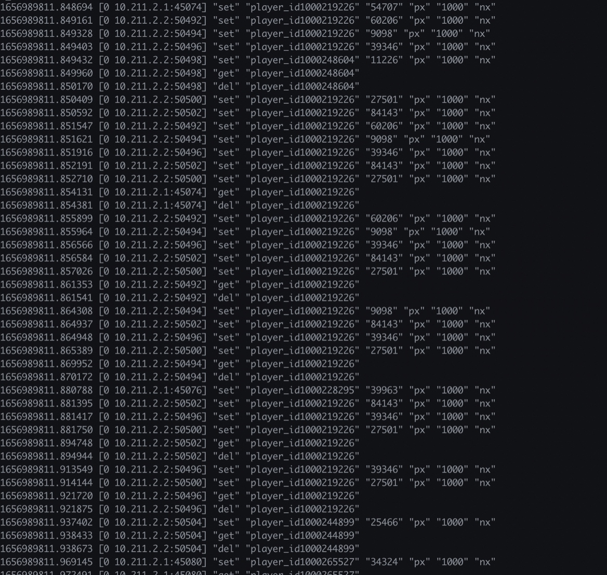

## 后端记录
[排查redis连接数过高](#p1)

[排查CPU 100%进程](#p2)
- [CPU100%排查,ngx-lua-bt](#way1)
- [CPU100%排查,openresty-gdb-utils](#way2)

[http模块较低版本踩坑](#p3)

p1
====


#### 排查redis连接数过高
 

- 问题起因： 查询某个问题的时候在lua-server查看netstat，发现连接redis某个公用端口：6380的连接中CLOSE_WAIT过高

- 排查经过：
    1. 怀疑redis没有keepalive，这个仔细看了一下项目的源码，发现每次`do_command` 之后都会把连接放回池子，排除这种可能
    2. 怀疑有些慢指令，后面命令在排队，`slowlog get 20`看了一下，发现没有最近一段时间的慢指令
    3. 查看redis具体在干嘛，谨慎的把两个公用redis（6379，6380）开了几秒monitor，发现6380日志大小是6379的七倍，那看来应该首先从指令数上就不对，6380这个redis我们用的并不多。接下来基于monitor的日志排查
        
        - awk print一下命令前缀，发现hget，get，set，zrank，zrevrange这种比较高，联系项目实际情况，hget, zrank, zrevrange这几个指令是boss系统的指令，对boss这个模块优化
        - 优化后发现其实还是很高，vim进去看看这些get set都在干啥，发现好像是上锁操作，看看自己项目的上锁代码确实没有keepalive并且占用了公用redis端口，问题这个时候已经查到了
        
    
- 解决方法：
    新开一个端口用于上锁，同时请求结束的时候lock的redis统一keepalive，连接数过高的情况解决

p2
====

#### nginx workerCPU跑满的处理


测试先从简，跑这个command脚本
```lua
game@projectG-0-199:~/release/lua-server$ cat command/test.lua
local ngx = ngx
local t = 1

local time = ngx.time()
while true do
    t = t * 2
    ngx.update_time()
    if ngx.time() - time > 100 then
        break
    end
end
print(t)
```

考虑借助一些工具来排查

- https://blog.csdn.net/weixin_33862041/article/details/93972380 这个博客是一个排查CPU跑满的实践，主要流程是gdb打到worker上，bt把堆栈打印一下，找到luajit在哪个地址，反编译一下，偏移量做差，找到具体的lua代码。意思是这么个意思，细看我也没细看，感觉太麻烦了，继续找别的工具
- https://blog.openresty.com.cn/cn/bilibili-xray-incident/ openresty xray，帮b站排查到了lua代码死循环，但是是商用的，放弃
- openresty开源的sample工具 https://github.com/openresty/openresty-systemtap-toolkit 看上去可以，先从里面找个看上去对劲的 `ngx-sample-lua-bt`  
  ```shell
    game@projectG-0-199:~/openresty_tools/openresty-systemtap-toolkit$ sudo ./ngx-sample-lua-bt -p 13679 --luajit20 -t 20 > tmp.bt
    WARNING: Tracing 13679 (/usr/local/openresty/nginx/sbin/nginx)  for LuaJIT 2.0...
    WARNING: Time's up. Quitting now...
    game@projectG-0-199:~/openresty_tools/openresty-systemtap-toolkit$ vim tmp.bt
   ```
   发现里面什么都没，查了一下应该是个bug，说明这个不能用,后面review这个工具集的时候发现readme里强调了这个指令有很多bug，不太建议用

way1
====

- 换这个工具的其他指令，`ngx-lua-bt` 他定位到了lua代码，command第七行（每次sample其实都是不同行数，死循环6-9行都是，定位到某一行肯定就算解决了问题。
```shell
game@projectG-0-199:~/openresty_tools/openresty-systemtap-toolkit$ sudo ./ngx-lua-bt -p 14877 --luajit20
WARNING: Probe 'process' has been elided: keyword at <input>:369:1
 source: probe
         ^
WARNING: Tracing 14877 (/usr/local/openresty/nginx/sbin/nginx) for LuaJIT 2.0...
C:ngx_http_lua_ngx_update_time
@./command/test.lua:7
=init_worker_by_lua:45
C:lj_ffh_pcall
=init_worker_by_lua:52    
```
way2
====

- 再试验一下openresty其他repo里面的工具，https://github.com/openresty/openresty-gdb-utils 这个一样可用


这个问题到这里就解决了

p3
====

项目要向大数据pub打点数据，他是个HTTPS，因为之前我们跟平台或者游戏内不同后端机器通信都是用的HTTP，没有用过HTTPS，在开始的时候踩了很多坑（因为网上很多文档没有resty.http的较老版本使用，官方文档也比较难找

- 较低版本需要手动握手，需要`hc:ssl_handshake(false, host, false)` 
    https://github.com/openresty/lua-nginx-module#tcpsocksslhandshake
    第一个false因为启用了连接池，所以不需要true，第三个false表示不验证CA certificates
- pub的时候发现分配不出去端口，几条正常的协议中间就会有几条`can't assign` ,这个是比较离谱的，我们测试服空闲端口应该挺多的，sysctl一顿乱改ipv4配置，一点都没用。问其他项目后端也不知道怎么解决。后来问了运维，他改了nginx的resolver配置，解决了这个问题，也就是resolver ipv6=off，也就是nginx自己实现的类似DNS的东西，不关ipv6回随机用ipv4或者ipv6去解析大数据的hostname，ipv6的时候会有问题。
- 我们每天有一段时间疯狂500，秋落发现的原因，pub的时候，和BQ那边做了一个优化，很多条加起来一起发，请求body太长（全服结算之类的），超时了，没返回任何东西。这个就直接G了，因为没法判断是否需要重发，所以seq id就对不上了。解决方式是body拆掉，然后和大数据那边制定更详细的错误处理机制。
